# Technical Specifications

## 1. INTRODUCTION

### EXECUTIVE SUMMARY

| Aspect | Description |
|--------|-------------|
| Project Overview | A simple Node.js HTTP server application that exposes a single REST endpoint `/hello` which returns "Hello world" to clients |
| Business Problem | Provides a minimal, functional example of a Node.js web service that can serve as a learning tool or starter template |
| Key Stakeholders | Developers learning Node.js, technical trainers, software engineers requiring a baseline implementation |
| Value Proposition | Demonstrates fundamental Node.js web service concepts with minimal complexity, enabling rapid learning and implementation |

### SYSTEM OVERVIEW

#### Project Context

| Context Element | Description |
|-----------------|-------------|
| Business Context | Educational tool for Node.js server development fundamentals |
| Current Limitations | N/A - New implementation |
| Enterprise Integration | Standalone application with no external dependencies beyond Node.js runtime |

#### High-Level Description

| Component | Description |
|-----------|-------------|
| Primary Capabilities | HTTP request handling, REST endpoint implementation, response generation |
| Major Components | Node.js runtime, HTTP server module, route handler for `/hello` endpoint |
| Technical Approach | Lightweight implementation using Node.js core modules without additional frameworks |

#### Success Criteria

| Criteria Type | Description |
|---------------|-------------|
| Measurable Objectives | 1. Server successfully starts and listens for connections<br>2. `/hello` endpoint returns "Hello world" with 200 status code<br>3. Documentation enables new users to run the application |
| Critical Success Factors | 1. Code simplicity and readability<br>2. Proper error handling<br>3. Clear documentation |
| Key Performance Indicators | 1. Response time under 100ms<br>2. Successful response rate of 100%<br>3. Zero unhandled exceptions |

### SCOPE

#### In-Scope

**Core Features and Functionalities**
- HTTP server implementation in Node.js
- Single REST endpoint `/hello` returning "Hello world" text response
- Basic error handling for server startup
- Proper HTTP status codes and headers

**Implementation Boundaries**
- Single-server implementation
- Local development environment support
- Command-line interface for server startup
- HTTP protocol support

#### Out-of-Scope

- Authentication and authorization mechanisms
- Database integration
- Multiple endpoints beyond `/hello`
- Production deployment configurations
- HTTPS/TLS support
- Logging infrastructure
- Performance optimization
- Containerization
- CI/CD pipeline integration
- Load balancing or clustering

## 2. PRODUCT REQUIREMENTS

### FEATURE CATALOG

#### Feature Metadata

| ID | Feature Name | Feature Category | Priority Level | Status |
|----|--------------|------------------|----------------|--------|
| F-001 | Hello World Endpoint | Core API | Critical | Approved |
| F-002 | HTTP Server | Infrastructure | Critical | Approved |
| F-003 | Server Configuration | Configuration | High | Approved |
| F-004 | Error Handling | Reliability | High | Approved |

#### Feature Descriptions

**F-001: Hello World Endpoint**

| Aspect | Description |
|--------|-------------|
| Overview | REST endpoint at `/hello` path that returns "Hello world" text response |
| Business Value | Demonstrates fundamental API implementation in Node.js |
| User Benefits | Provides simple, working example of HTTP response handling |
| Technical Context | Core demonstration of HTTP request/response cycle in Node.js |

**F-002: HTTP Server**

| Aspect | Description |
|--------|-------------|
| Overview | Basic HTTP server implementation using Node.js core modules |
| Business Value | Establishes foundation for serving web requests |
| User Benefits | Enables interaction with the application via standard HTTP protocol |
| Technical Context | Utilizes Node.js http module to create and manage server instance |

**F-003: Server Configuration**

| Aspect | Description |
|--------|-------------|
| Overview | Configuration for server port and basic operational parameters |
| Business Value | Enables flexibility in deployment environments |
| User Benefits | Allows customization of server behavior without code changes |
| Technical Context | Environment variable support for configuration management |

**F-004: Error Handling**

| Aspect | Description |
|--------|-------------|
| Overview | Basic error handling for server startup and request processing |
| Business Value | Improves reliability and troubleshooting capabilities |
| User Benefits | Provides clear feedback when errors occur |
| Technical Context | Implements error event listeners and appropriate HTTP status codes |

#### Dependencies

**F-001: Hello World Endpoint**

| Dependency Type | Dependencies |
|-----------------|--------------|
| Prerequisite Features | F-002 HTTP Server |
| System Dependencies | Node.js runtime |
| External Dependencies | None |
| Integration Requirements | None |

**F-002: HTTP Server**

| Dependency Type | Dependencies |
|-----------------|--------------|
| Prerequisite Features | None |
| System Dependencies | Node.js runtime |
| External Dependencies | None |
| Integration Requirements | None |

**F-003: Server Configuration**

| Dependency Type | Dependencies |
|-----------------|--------------|
| Prerequisite Features | F-002 HTTP Server |
| System Dependencies | Node.js runtime |
| External Dependencies | None |
| Integration Requirements | None |

**F-004: Error Handling**

| Dependency Type | Dependencies |
|-----------------|--------------|
| Prerequisite Features | F-002 HTTP Server |
| System Dependencies | Node.js runtime |
| External Dependencies | None |
| Integration Requirements | None |

### FUNCTIONAL REQUIREMENTS TABLE

**F-001: Hello World Endpoint**

| Requirement ID | Description | Acceptance Criteria | Priority |
|----------------|-------------|---------------------|----------|
| F-001-RQ-001 | The server shall expose a REST endpoint at the path `/hello` | Endpoint is accessible via HTTP GET request to `/hello` | Must-Have |
| F-001-RQ-002 | The `/hello` endpoint shall return the text "Hello world" | Response body contains exactly "Hello world" | Must-Have |
| F-001-RQ-003 | The `/hello` endpoint shall return a 200 OK status code | Response includes HTTP 200 status code | Must-Have |
| F-001-RQ-004 | The `/hello` endpoint shall return content with appropriate headers | Response includes Content-Type: text/plain header | Should-Have |

**Technical Specifications for F-001**

| Aspect | Specification |
|--------|---------------|
| Input Parameters | None required |
| Output/Response | Plain text "Hello world" |
| Performance Criteria | Response time < 100ms |
| Data Requirements | None |

**Validation Rules for F-001**

| Rule Type | Rules |
|-----------|-------|
| Business Rules | None |
| Data Validation | None |
| Security Requirements | None |
| Compliance Requirements | None |

**F-002: HTTP Server**

| Requirement ID | Description | Acceptance Criteria | Priority |
|----------------|-------------|---------------------|----------|
| F-002-RQ-001 | The application shall create an HTTP server using Node.js | Server successfully initializes | Must-Have |
| F-002-RQ-002 | The server shall listen on a configurable port | Server binds to specified port | Must-Have |
| F-002-RQ-003 | The server shall handle incoming HTTP requests | Server responds to HTTP requests | Must-Have |
| F-002-RQ-004 | The server shall route requests to appropriate handlers | Requests to `/hello` route to correct handler | Must-Have |

**Technical Specifications for F-002**

| Aspect | Specification |
|--------|---------------|
| Input Parameters | Port number (optional, default: 3000) |
| Output/Response | Running HTTP server instance |
| Performance Criteria | Server startup time < 1 second |
| Data Requirements | None |

**F-003: Server Configuration**

| Requirement ID | Description | Acceptance Criteria | Priority |
|----------------|-------------|---------------------|----------|
| F-003-RQ-001 | The server shall use port 3000 by default | Server starts on port 3000 when no port specified | Should-Have |
| F-003-RQ-002 | The server shall support custom port via environment variable | Server uses PORT environment variable when available | Should-Have |
| F-003-RQ-003 | The server shall log the port it's listening on at startup | Console output indicates listening port | Should-Have |

**Technical Specifications for F-003**

| Aspect | Specification |
|--------|---------------|
| Input Parameters | PORT environment variable (optional) |
| Output/Response | Server configuration applied |
| Performance Criteria | Configuration processing time < 100ms |
| Data Requirements | None |

**F-004: Error Handling**

| Requirement ID | Description | Acceptance Criteria | Priority |
|----------------|-------------|---------------------|----------|
| F-004-RQ-001 | The server shall handle startup errors gracefully | Server logs error message and exits with non-zero code on startup failure | Should-Have |
| F-004-RQ-002 | The server shall return 404 for undefined routes | Requests to undefined routes receive 404 status code | Should-Have |
| F-004-RQ-003 | The server shall handle request processing errors | Server doesn't crash on malformed requests | Should-Have |

**Technical Specifications for F-004**

| Aspect | Specification |
|--------|---------------|
| Input Parameters | Error events, undefined routes |
| Output/Response | Appropriate error responses and status codes |
| Performance Criteria | Error handling overhead < 50ms |
| Data Requirements | None |

### FEATURE RELATIONSHIPS

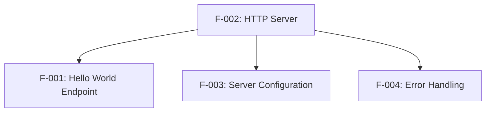
```mermaid
graph TD
    F002[F-002: HTTP Server] --> F001[F-001: Hello World Endpoint]
    F002 --> F003[F-003: Server Configuration]
    F002 --> F004[F-004: Error Handling]
```

#### Integration Points

| Feature | Integration Points |
|---------|-------------------|
| F-001 | Integrates with F-002 for request handling |
| F-002 | Integrates with Node.js http module |
| F-003 | Integrates with F-002 for server configuration |
| F-004 | Integrates with F-002 for error event handling |

### IMPLEMENTATION CONSIDERATIONS

**F-001: Hello World Endpoint**

| Consideration | Description |
|---------------|-------------|
| Technical Constraints | Must use Node.js core modules only |
| Performance Requirements | Response time < 100ms |
| Scalability Considerations | None for this simple endpoint |
| Security Implications | None for this basic implementation |
| Maintenance Requirements | Minimal, code should be self-documenting |

**F-002: HTTP Server**

| Consideration | Description |
|---------------|-------------|
| Technical Constraints | Must use Node.js core http module |
| Performance Requirements | Handle multiple concurrent connections |
| Scalability Considerations | None for this tutorial implementation |
| Security Implications | Basic server hardening practices |
| Maintenance Requirements | Clear server lifecycle management |

**F-003: Server Configuration**

| Consideration | Description |
|---------------|-------------|
| Technical Constraints | Environment variable based configuration |
| Performance Requirements | None |
| Scalability Considerations | None |
| Security Implications | None |
| Maintenance Requirements | Document configuration options |

**F-004: Error Handling**

| Consideration | Description |
|---------------|-------------|
| Technical Constraints | Must use Node.js error handling patterns |
| Performance Requirements | Minimal overhead for error cases |
| Scalability Considerations | None |
| Security Implications | Avoid leaking sensitive information in error responses |
| Maintenance Requirements | Clear error messages for troubleshooting |

### TRACEABILITY MATRIX

| Requirement ID | Feature ID | Priority | Status |
|----------------|-----------|----------|--------|
| F-001-RQ-001 | F-001 | Must-Have | Approved |
| F-001-RQ-002 | F-001 | Must-Have | Approved |
| F-001-RQ-003 | F-001 | Must-Have | Approved |
| F-001-RQ-004 | F-001 | Should-Have | Approved |
| F-002-RQ-001 | F-002 | Must-Have | Approved |
| F-002-RQ-002 | F-002 | Must-Have | Approved |
| F-002-RQ-003 | F-002 | Must-Have | Approved |
| F-002-RQ-004 | F-002 | Must-Have | Approved |
| F-003-RQ-001 | F-003 | Should-Have | Approved |
| F-003-RQ-002 | F-003 | Should-Have | Approved |
| F-003-RQ-003 | F-003 | Should-Have | Approved |
| F-004-RQ-001 | F-004 | Should-Have | Approved |
| F-004-RQ-002 | F-004 | Should-Have | Approved |
| F-004-RQ-003 | F-004 | Should-Have | Approved |

## 3. TECHNOLOGY STACK

### PROGRAMMING LANGUAGES

| Component | Language | Version | Justification |
|-----------|----------|---------|---------------|
| Server | JavaScript (Node.js) | 18.x LTS | Node.js is the primary requirement for this project. The LTS version provides stability and long-term support for production use. JavaScript is the native language for Node.js runtime. |

**Selection Criteria:**
- Node.js was explicitly requested in the project requirements
- JavaScript is the native language for Node.js development
- LTS versions provide stability and security updates

### FRAMEWORKS & LIBRARIES

| Component | Library/Framework | Version | Purpose | Justification |
|-----------|-------------------|---------|---------|---------------|
| HTTP Server | Node.js Core HTTP module | Built-in | Server implementation | Using the built-in HTTP module aligns with the minimal approach and eliminates external dependencies, making the tutorial simpler to understand and maintain. |

**Compatibility Requirements:**
- Node.js 18.x LTS or higher

**Framework Selection Justification:**
- No external frameworks are required for this simple application
- Using core Node.js modules provides a foundational learning experience
- Minimizes dependencies, reducing complexity and potential security issues
- Aligns with the educational purpose of demonstrating Node.js fundamentals

### DATABASES & STORAGE

*Not applicable for this project.*

This simple HTTP server with a single endpoint does not require any data persistence or storage solutions. All functionality is stateless and requires no database integration.

### THIRD-PARTY SERVICES

*Not applicable for this project.*

The application is self-contained and does not require integration with any external services, APIs, or third-party tools.

### DEVELOPMENT & DEPLOYMENT

| Category | Tool/Technology | Version | Purpose |
|----------|-----------------|---------|---------|
| Development | Node.js runtime | 18.x LTS | JavaScript runtime environment |
| Development | npm (Node Package Manager) | 8.x+ | Dependency management |
| Version Control | Git | 2.x+ | Source code management |

**Development Environment Requirements:**
- Node.js 18.x LTS or higher installed locally
- Basic command-line interface for starting the server
- Text editor or IDE for JavaScript development

**Deployment Considerations:**
- Simple deployment via direct Node.js execution
- No containerization required for this tutorial application
- Can be run on any system with Node.js installed

### TECHNOLOGY STACK DIAGRAM

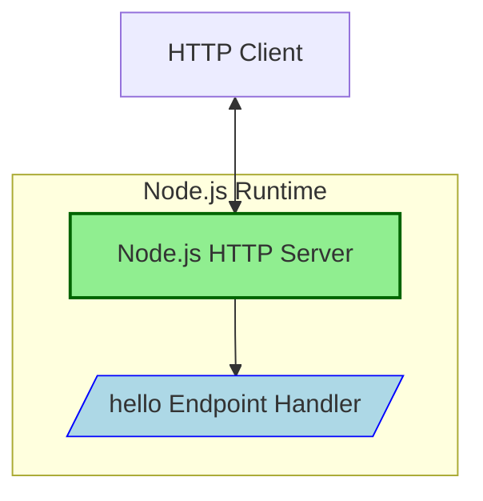
```mermaid
flowchart TD
    client[HTTP Client] <--> server[Node.js HTTP Server]
    server --> handler[/hello Endpoint Handler/]
    
    subgraph "Node.js Runtime"
        server
        handler
    end
    
    classDef primary fill:#90EE90,stroke:#006400,stroke-width:2px
    classDef secondary fill:#ADD8E6,stroke:#0000FF,stroke-width:1px
    
    class server primary
    class handler secondary
```

## 4. PROCESS FLOWCHART

### SYSTEM WORKFLOWS

#### Core Business Processes

**HTTP Request Processing Workflow**

| Process Step | Description | Actors |
|--------------|-------------|--------|
| Request Initiation | Client initiates HTTP request to `/hello` endpoint | HTTP Client |
| Request Reception | Node.js server receives the incoming HTTP request | HTTP Server |
| Route Matching | Server matches request URL to defined routes | HTTP Server |
| Response Generation | Server generates "Hello world" response for matching route | Route Handler |
| Response Delivery | Server sends response back to client | HTTP Server |
| Error Handling | Server handles any errors that occur during processing | Error Handler |

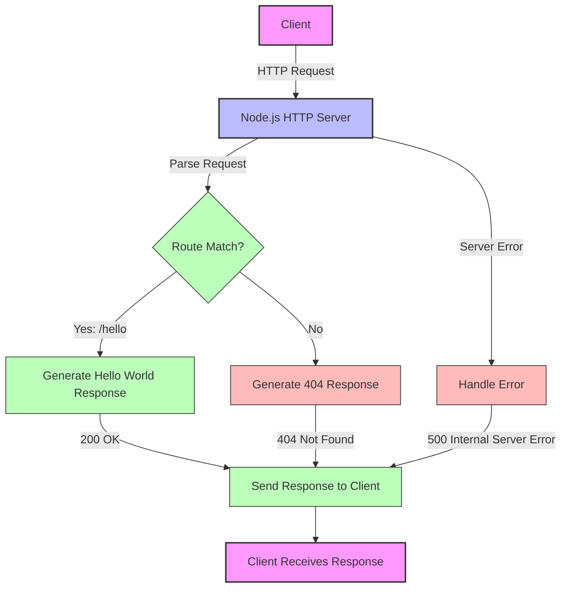
```mermaid
flowchart TD
    A[Client] -->|HTTP Request| B[Node.js HTTP Server]
    B -->|Parse Request| C{Route Match?}
    C -->|Yes: /hello| D[Generate Hello World Response]
    C -->|No| E[Generate 404 Response]
    D -->|200 OK| F[Send Response to Client]
    E -->|404 Not Found| F
    F --> G[Client Receives Response]
    B -->|Server Error| H[Handle Error]
    H -->|500 Internal Server Error| F
    
    classDef client fill:#f9f,stroke:#333,stroke-width:2px
    classDef server fill:#bbf,stroke:#333,stroke-width:2px
    classDef process fill:#bfb,stroke:#333,stroke-width:1px
    classDef error fill:#fbb,stroke:#333,stroke-width:1px
    
    class A,G client
    class B server
    class C,D,F process
    class E,H error
```

**Server Startup Workflow**

| Process Step | Description | Actors |
|--------------|-------------|--------|
| Configuration Loading | Load server configuration (port) | Configuration Manager |
| Server Initialization | Initialize HTTP server instance | HTTP Server |
| Port Binding | Bind server to configured port | HTTP Server |
| Route Registration | Register `/hello` route handler | Route Manager |
| Error Handler Registration | Set up error event listeners | Error Handler |
| Server Start | Start listening for incoming connections | HTTP Server |

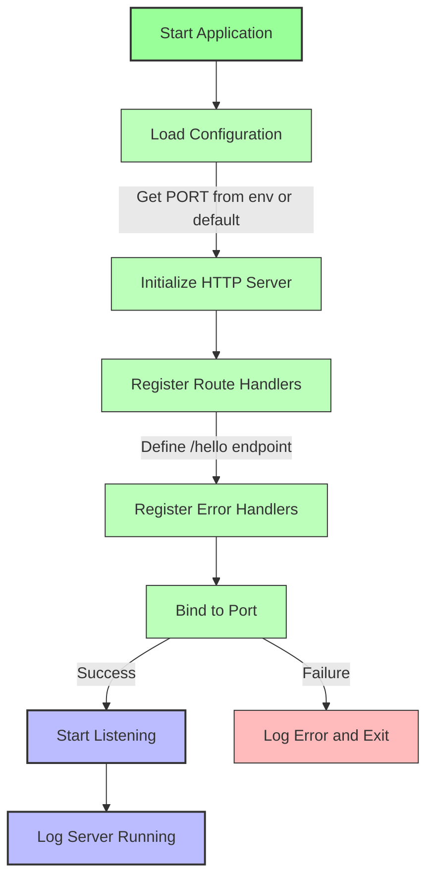
```mermaid
flowchart TD
    A[Start Application] --> B[Load Configuration]
    B -->|Get PORT from env or default| C[Initialize HTTP Server]
    C --> D[Register Route Handlers]
    D -->|Define /hello endpoint| E[Register Error Handlers]
    E --> F[Bind to Port]
    F -->|Success| G[Start Listening]
    F -->|Failure| H[Log Error and Exit]
    G --> I[Log Server Running]
    
    classDef start fill:#9f9,stroke:#333,stroke-width:2px
    classDef process fill:#bfb,stroke:#333,stroke-width:1px
    classDef error fill:#fbb,stroke:#333,stroke-width:1px
    classDef endNode fill:#bbf,stroke:#333,stroke-width:2px
    
    class A start
    class B,C,D,E,F process
    class H error
    class G,I endNode
```

#### Integration Workflows

**HTTP Request-Response Cycle**

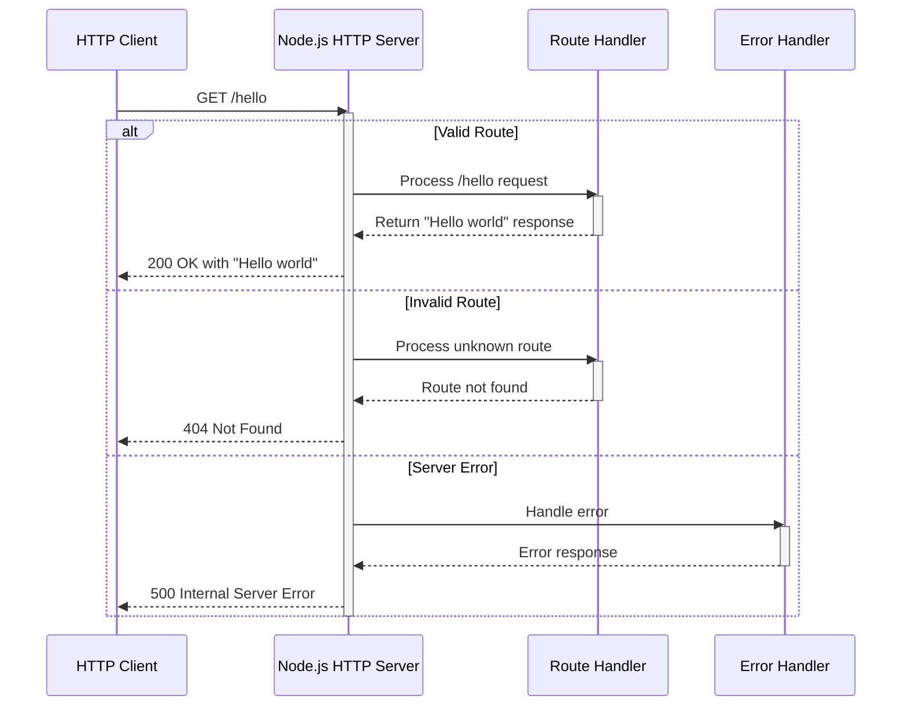
```mermaid
sequenceDiagram
    participant Client as HTTP Client
    participant Server as Node.js HTTP Server
    participant Router as Route Handler
    participant ErrorHandler as Error Handler
    
    Client->>Server: GET /hello
    activate Server
    
    alt Valid Route
        Server->>Router: Process /hello request
        activate Router
        Router-->>Server: Return "Hello world" response
        deactivate Router
        Server-->>Client: 200 OK with "Hello world"
    else Invalid Route
        Server->>Router: Process unknown route
        activate Router
        Router-->>Server: Route not found
        deactivate Router
        Server-->>Client: 404 Not Found
    else Server Error
        Server->>ErrorHandler: Handle error
        activate ErrorHandler
        ErrorHandler-->>Server: Error response
        deactivate ErrorHandler
        Server-->>Client: 500 Internal Server Error
    end
    
    deactivate Server
```

### FLOWCHART REQUIREMENTS

#### Detailed Process Flow for Hello World Endpoint

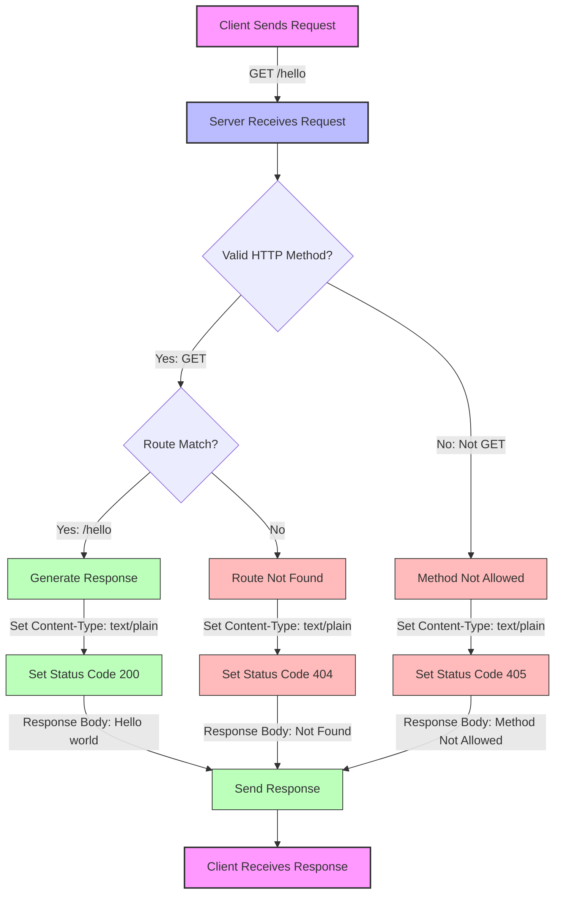
```mermaid
flowchart TD
    A[Client Sends Request] -->|GET /hello| B[Server Receives Request]
    B --> C{Valid HTTP Method?}
    C -->|Yes: GET| D{Route Match?}
    C -->|No: Not GET| E[Method Not Allowed]
    D -->|Yes: /hello| F[Generate Response]
    D -->|No| G[Route Not Found]
    F -->|Set Content-Type: text/plain| H[Set Status Code 200]
    G -->|Set Content-Type: text/plain| I[Set Status Code 404]
    E -->|Set Content-Type: text/plain| J[Set Status Code 405]
    H -->|"Response Body: Hello world"| K[Send Response]
    I -->|"Response Body: Not Found"| K
    J -->|"Response Body: Method Not Allowed"| K
    K --> L[Client Receives Response]
    
    classDef client fill:#f9f,stroke:#333,stroke-width:2px
    classDef server fill:#bbf,stroke:#333,stroke-width:2px
    classDef process fill:#bfb,stroke:#333,stroke-width:1px
    classDef error fill:#fbb,stroke:#333,stroke-width:1px
    classDef response fill:#ffd,stroke:#333,stroke-width:1px
    
    class A,L client
    class B server
    class C,D decision
    class E,G,I,J error
    class F,H,K process
```

#### Error Handling Flowchart

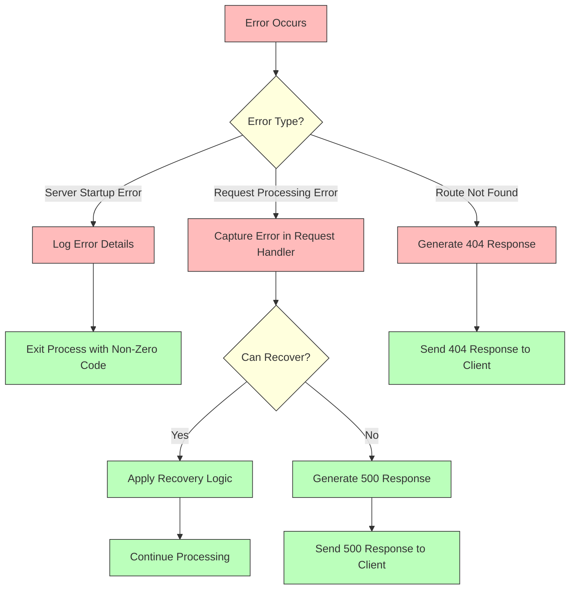
```mermaid
flowchart TD
    A[Error Occurs] --> B{Error Type?}
    
    B -->|Server Startup Error| C[Log Error Details]
    B -->|Request Processing Error| D[Capture Error in Request Handler]
    B -->|Route Not Found| E[Generate 404 Response]
    
    C --> F[Exit Process with Non-Zero Code]
    
    D --> G{Can Recover?}
    G -->|Yes| H[Apply Recovery Logic]
    G -->|No| I[Generate 500 Response]
    
    E --> J[Send 404 Response to Client]
    H --> K[Continue Processing]
    I --> L[Send 500 Response to Client]
    
    classDef error fill:#fbb,stroke:#333,stroke-width:1px
    classDef process fill:#bfb,stroke:#333,stroke-width:1px
    classDef decision fill:#ffd,stroke:#333,stroke-width:1px
    classDef response fill:#bbf,stroke:#333,stroke-width:1px
    
    class A,C,D,E error
    class B,G decision
    class F,H,I,J,K,L process
```

### TECHNICAL IMPLEMENTATION

#### State Management

**Request Processing State Transitions**

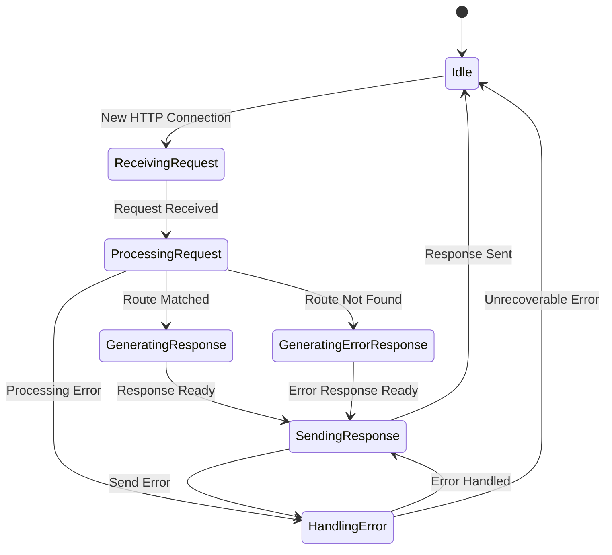
```mermaid
stateDiagram-v2
    [*] --> Idle
    Idle --> ReceivingRequest: New HTTP Connection
    ReceivingRequest --> ProcessingRequest: Request Received
    ProcessingRequest --> GeneratingResponse: Route Matched
    ProcessingRequest --> GeneratingErrorResponse: Route Not Found
    ProcessingRequest --> HandlingError: Processing Error
    GeneratingResponse --> SendingResponse: Response Ready
    GeneratingErrorResponse --> SendingResponse: Error Response Ready
    HandlingError --> SendingResponse: Error Handled
    SendingResponse --> Idle: Response Sent
    SendingResponse --> HandlingError: Send Error
    HandlingError --> Idle: Unrecoverable Error
```

#### Error Handling

**Error Recovery Procedures**

| Error Type | Recovery Procedure | Notification Method |
|------------|-------------------|---------------------|
| Server Startup Error | Log error and exit with non-zero code | Console error log |
| Port Already In Use | Log specific error message suggesting port change | Console error log |
| Invalid Route Request | Return 404 Not Found response | HTTP 404 status code |
| Method Not Allowed | Return 405 Method Not Allowed response | HTTP 405 status code |
| Request Processing Error | Return 500 Internal Server Error response | HTTP 500 status code |
| Connection Error | Attempt to gracefully close connection | None - connection already broken |

### REQUIRED DIAGRAMS

#### High-Level System Workflow

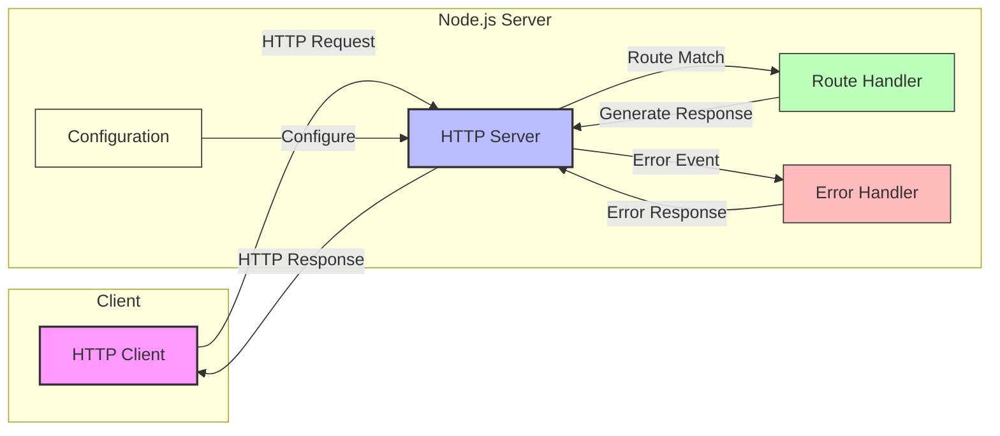
```mermaid
flowchart LR
    subgraph Client
        A[HTTP Client]
    end
    
    subgraph "Node.js Server"
        B[HTTP Server]
        C[Route Handler]
        D[Error Handler]
        E[Configuration]
    end
    
    A -->|HTTP Request| B
    B -->|Route Match| C
    B -->|Error Event| D
    E -->|Configure| B
    C -->|Generate Response| B
    D -->|Error Response| B
    B -->|HTTP Response| A
    
    classDef client fill:#f9f,stroke:#333,stroke-width:2px
    classDef server fill:#bbf,stroke:#333,stroke-width:2px
    classDef handler fill:#bfb,stroke:#333,stroke-width:1px
    classDef error fill:#fbb,stroke:#333,stroke-width:1px
    classDef config fill:#ffd,stroke:#333,stroke-width:1px
    
    class A client
    class B server
    class C handler
    class D error
    class E config
```

#### Integration Sequence Diagram

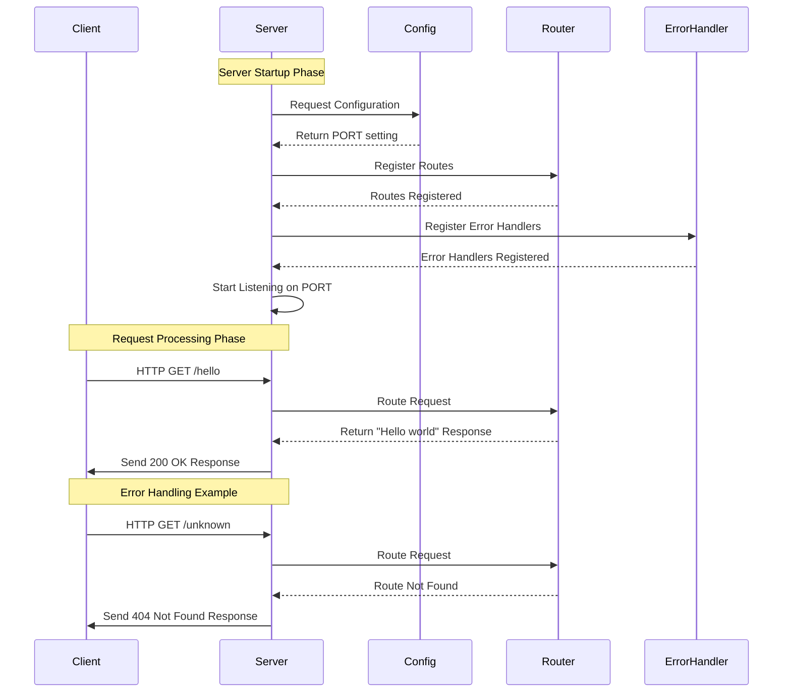
```mermaid
sequenceDiagram
    participant Client
    participant Server
    participant Config
    participant Router
    participant ErrorHandler
    
    Note over Server: Server Startup Phase
    Server->>Config: Request Configuration
    Config-->>Server: Return PORT setting
    Server->>Router: Register Routes
    Router-->>Server: Routes Registered
    Server->>ErrorHandler: Register Error Handlers
    ErrorHandler-->>Server: Error Handlers Registered
    Server->>Server: Start Listening on PORT
    
    Note over Client,Server: Request Processing Phase
    Client->>Server: HTTP GET /hello
    Server->>Router: Route Request
    Router-->>Server: Return "Hello world" Response
    Server->>Client: Send 200 OK Response
    
    Note over Client,Server: Error Handling Example
    Client->>Server: HTTP GET /unknown
    Server->>Router: Route Request
    Router-->>Server: Route Not Found
    Server->>Client: Send 404 Not Found Response
```

#### State Transition Diagram for Server Lifecycle

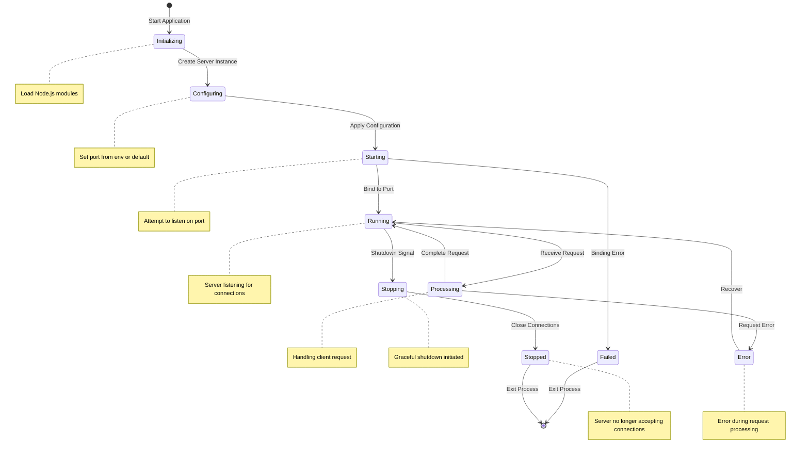
```mermaid
stateDiagram-v2
    [*] --> Initializing: Start Application
    Initializing --> Configuring: Create Server Instance
    Configuring --> Starting: Apply Configuration
    Starting --> Running: Bind to Port
    Starting --> Failed: Binding Error
    Running --> Processing: Receive Request
    Processing --> Running: Complete Request
    Processing --> Error: Request Error
    Error --> Running: Recover
    Running --> Stopping: Shutdown Signal
    Failed --> [*]: Exit Process
    Stopping --> Stopped: Close Connections
    Stopped --> [*]: Exit Process
    
    note right of Initializing: Load Node.js modules
    note right of Configuring: Set port from env or default
    note right of Starting: Attempt to listen on port
    note right of Running: Server listening for connections
    note right of Processing: Handling client request
    note right of Error: Error during request processing
    note right of Stopping: Graceful shutdown initiated
    note right of Stopped: Server no longer accepting connections
```

## 5. SYSTEM ARCHITECTURE

### HIGH-LEVEL ARCHITECTURE

#### System Overview

The Node.js Hello World application follows a simple monolithic architecture pattern, appropriate for its minimal requirements and educational purpose. The system employs a straightforward request-response model using Node.js core HTTP module.

**Architectural Style and Rationale:**
- **Single-Tier Architecture**: The application operates as a standalone web server without separate tiers for business logic or data storage.
- **RESTful Design**: Although minimal, the application follows REST principles with a clearly defined endpoint that responds to HTTP GET requests.
- **Modular Structure**: Despite its simplicity, the code organization separates concerns between server initialization, request handling, and error management.

**Key Architectural Principles:**
- **Simplicity**: Minimalist design with no external dependencies beyond Node.js core modules.
- **Statelessness**: The server maintains no client state between requests.
- **Single Responsibility**: Each component has a clear, focused purpose.

**System Boundaries and Interfaces:**
- **External Boundary**: HTTP interface exposed on configured port.
- **Internal Interfaces**: Function calls between server and route handler components.

#### Core Components Table

| Component Name | Primary Responsibility | Key Dependencies | Integration Points | Critical Considerations |
|----------------|------------------------|------------------|-------------------|------------------------|
| HTTP Server | Listen for and process incoming HTTP requests | Node.js http module | Client applications | Port configuration, error handling |
| Route Handler | Process requests to specific routes and generate responses | HTTP Server | HTTP Server | Response formatting, status codes |
| Configuration Manager | Manage server configuration settings | Node.js process/env | HTTP Server | Environment variable handling |
| Error Handler | Capture and process error conditions | HTTP Server | HTTP Server | Graceful error responses |

#### Data Flow Description

The data flow in this simple application is straightforward and unidirectional:

1. **Client Request Flow**: HTTP clients send GET requests to the server's `/hello` endpoint.
2. **Request Processing**: The HTTP server component receives the request and passes it to the route handler.
3. **Response Generation**: The route handler generates a plain text "Hello world" response.
4. **Response Delivery**: The HTTP server returns the response to the client with appropriate headers and status code.

There are no data stores or caches in this simple application. All processing happens in-memory without persistence requirements.

#### External Integration Points

| System Name | Integration Type | Data Exchange Pattern | Protocol/Format | SLA Requirements |
|-------------|------------------|------------------------|----------------|------------------|
| HTTP Clients | Synchronous API | Request-Response | HTTP/Plain Text | Response time < 100ms |

### COMPONENT DETAILS

#### HTTP Server Component

**Purpose and Responsibilities:**
- Initialize and manage the HTTP server instance
- Listen for incoming connections on the configured port
- Route incoming requests to appropriate handlers
- Return responses to clients
- Handle server-level errors

**Technologies and Frameworks:**
- Node.js core `http` module
- No external frameworks or libraries

**Key Interfaces:**
- HTTP listener on configured TCP port
- Request handler function interface

**Data Persistence Requirements:**
- None - stateless operation

**Scaling Considerations:**
- Single process design suitable for educational purposes
- No clustering or load balancing in this simple implementation

#### Route Handler Component

**Purpose and Responsibilities:**
- Process requests to the `/hello` endpoint
- Generate appropriate HTTP responses
- Handle routing errors (404 for undefined routes)

**Technologies and Frameworks:**
- Pure JavaScript functions
- Node.js HTTP request/response objects

**Key Interfaces:**
- Function accepting request and response objects

**Data Persistence Requirements:**
- None - stateless operation

**Scaling Considerations:**
- Minimal computational requirements
- No state to synchronize across instances

#### Configuration Manager Component

**Purpose and Responsibilities:**
- Read environment variables for configuration
- Provide default values when environment variables are not set
- Initialize server with correct configuration

**Technologies and Frameworks:**
- Node.js `process.env` for environment variables

**Key Interfaces:**
- Internal function to retrieve configuration values

**Data Persistence Requirements:**
- None - configuration loaded at startup

**Scaling Considerations:**
- Configuration is read once at startup
- No runtime configuration changes supported

#### Error Handler Component

**Purpose and Responsibilities:**
- Capture and log server errors
- Provide appropriate error responses to clients
- Prevent server crashes from unhandled exceptions

**Technologies and Frameworks:**
- Node.js error events
- HTTP status codes for client communication

**Key Interfaces:**
- Error event listeners
- HTTP response for error communication

**Data Persistence Requirements:**
- None - errors handled in-memory

**Scaling Considerations:**
- Local error handling only
- No centralized error aggregation

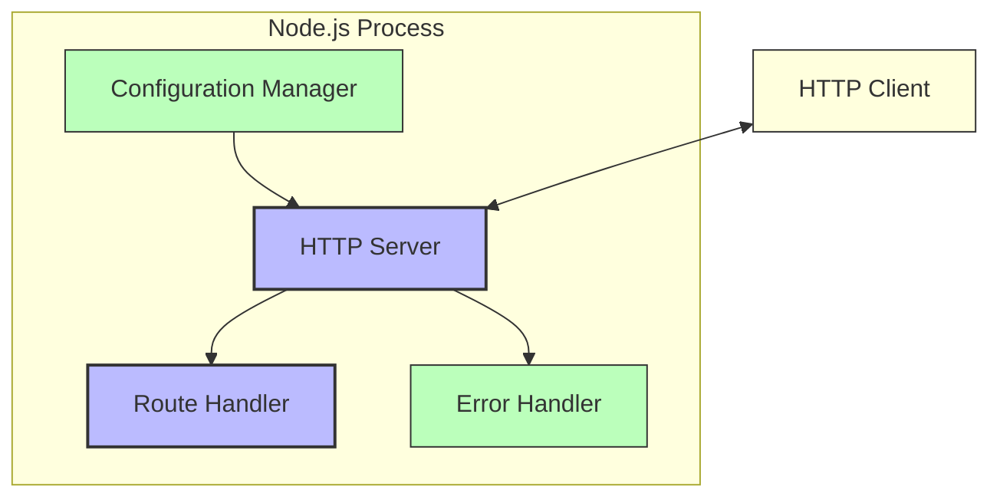
```mermaid
flowchart TD
    subgraph "Node.js Process"
        A[HTTP Server] --> B[Route Handler]
        A --> C[Error Handler]
        D[Configuration Manager] --> A
    end
    
    E[HTTP Client] <--> A
    
    classDef core fill:#bbf,stroke:#333,stroke-width:2px
    classDef support fill:#bfb,stroke:#333,stroke-width:1px
    classDef external fill:#ffd,stroke:#333,stroke-width:1px
    
    class A,B core
    class C,D support
    class E external
```

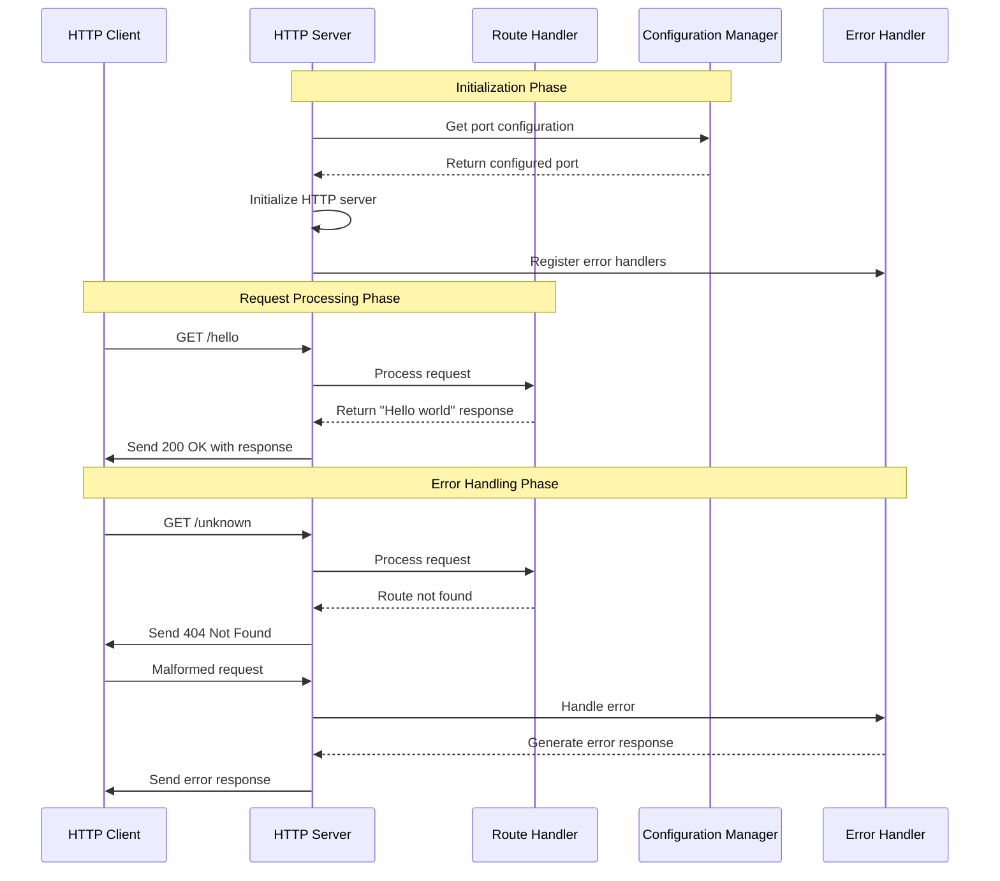
```mermaid
sequenceDiagram
    participant Client as HTTP Client
    participant Server as HTTP Server
    participant Router as Route Handler
    participant Config as Configuration Manager
    participant Error as Error Handler
    
    Note over Server,Config: Initialization Phase
    Server->>Config: Get port configuration
    Config-->>Server: Return configured port
    Server->>Server: Initialize HTTP server
    Server->>Error: Register error handlers
    
    Note over Client,Router: Request Processing Phase
    Client->>Server: GET /hello
    Server->>Router: Process request
    Router-->>Server: Return "Hello world" response
    Server->>Client: Send 200 OK with response
    
    Note over Client,Error: Error Handling Phase
    Client->>Server: GET /unknown
    Server->>Router: Process request
    Router-->>Server: Route not found
    Server->>Client: Send 404 Not Found
    
    Client->>Server: Malformed request
    Server->>Error: Handle error
    Error-->>Server: Generate error response
    Server->>Client: Send error response
```

### TECHNICAL DECISIONS

#### Architecture Style Decisions

| Decision | Selected Approach | Alternatives Considered | Rationale |
|----------|-------------------|-------------------------|-----------|
| Server Architecture | Single-process HTTP server | Express.js framework, Microservices | Simplicity and educational value. Core Node.js modules provide everything needed without additional dependencies. |
| Communication Pattern | Synchronous request-response | Event-driven, Streaming | Simplest pattern for demonstrating HTTP basics. Direct mapping to HTTP protocol fundamentals. |
| Error Handling | In-process with HTTP status codes | Centralized logging, Circuit breakers | Appropriate for the scale and educational purpose of the application. |

#### Communication Pattern Choices

The application uses a simple synchronous request-response pattern, which is the most appropriate for:
- Demonstrating fundamental HTTP concepts
- Providing immediate feedback to clients
- Maintaining simplicity in the codebase
- Avoiding unnecessary complexity for a tutorial application

This pattern directly maps to the HTTP protocol's request-response nature and requires no additional libraries or patterns.

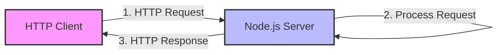
```mermaid
flowchart LR
    A[HTTP Client] -->|1. HTTP Request| B[Node.js Server]
    B -->|2. Process Request| B
    B -->|3. HTTP Response| A
    
    classDef client fill:#f9f,stroke:#333,stroke-width:2px
    classDef server fill:#bbf,stroke:#333,stroke-width:2px
    
    class A client
    class B server
```

### CROSS-CUTTING CONCERNS

#### Error Handling Patterns

The application implements several error handling patterns appropriate for its scope:

- **Server Startup Errors**: Captured during the initialization phase with appropriate console logging and process termination
- **Request Processing Errors**: Handled with appropriate HTTP status codes (404 for not found, 500 for server errors)
- **Unhandled Exceptions**: Global error event handlers prevent server crashes

**Error Handling Strategy:**
1. Attempt to handle errors at the source
2. Provide meaningful error messages
3. Return appropriate HTTP status codes
4. Prevent server crashes through global error handlers

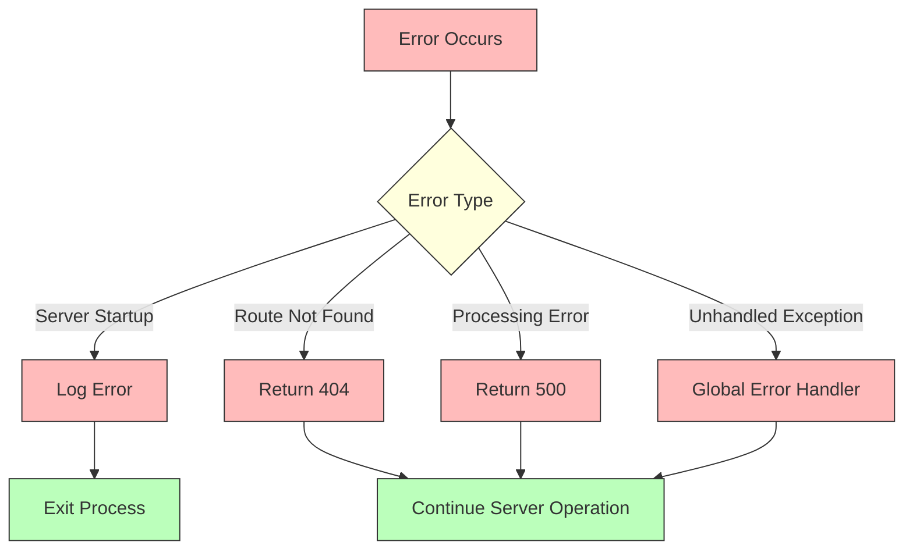
```mermaid
flowchart TD
    A[Error Occurs] --> B{Error Type}
    
    B -->|Server Startup| C[Log Error]
    B -->|Route Not Found| D[Return 404]
    B -->|Processing Error| E[Return 500]
    B -->|Unhandled Exception| F[Global Error Handler]
    
    C --> G[Exit Process]
    D --> H[Continue Server Operation]
    E --> H
    F --> H
    
    classDef error fill:#fbb,stroke:#333,stroke-width:1px
    classDef process fill:#bfb,stroke:#333,stroke-width:1px
    classDef decision fill:#ffd,stroke:#333,stroke-width:1px
    
    class A,C,D,E,F error
    class B decision
    class G,H process
```

#### Performance Requirements

| Requirement Type | Specification | Implementation Approach |
|------------------|---------------|-------------------------|
| Response Time | < 100ms for `/hello` endpoint | Minimal processing logic, direct response generation |
| Throughput | Sufficient for educational purposes | Single-threaded Node.js event loop |
| Resource Usage | Minimal memory footprint | No unnecessary buffering or caching |
| Startup Time | < 1 second | Minimal initialization, no complex configuration |

The application's performance requirements are minimal given its educational purpose. The Node.js event loop provides sufficient performance for handling multiple concurrent requests to this simple endpoint without additional optimization.

## 6. SYSTEM COMPONENTS DESIGN

### COMPONENT ARCHITECTURE

#### Component Structure

The Node.js Hello World application consists of four primary components organized in a simple, modular structure:

| Component | Type | Purpose | Dependencies |
|-----------|------|---------|--------------|
| Server | Core | HTTP server initialization and lifecycle management | http module, Configuration, Router, ErrorHandler |
| Router | Core | Request routing and response generation | None |
| Configuration | Support | Server configuration management | process.env |
| ErrorHandler | Support | Error capture and processing | None |

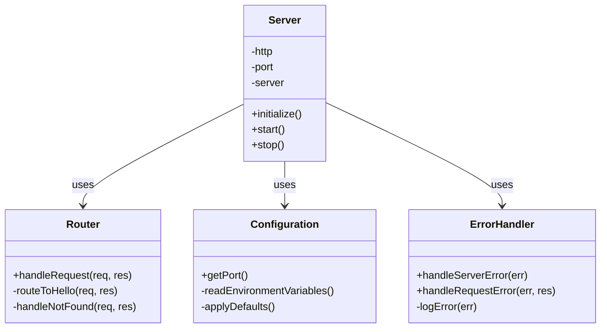
```mermaid
classDiagram
    class Server {
        -http
        -port
        -server
        +initialize()
        +start()
        +stop()
    }
    
    class Router {
        +handleRequest(req, res)
        -routeToHello(req, res)
        -handleNotFound(req, res)
    }
    
    class Configuration {
        +getPort()
        -readEnvironmentVariables()
        -applyDefaults()
    }
    
    class ErrorHandler {
        +handleServerError(err)
        +handleRequestError(err, res)
        -logError(err)
    }
    
    Server --> Router : uses
    Server --> Configuration : uses
    Server --> ErrorHandler : uses
```

#### Component Interactions

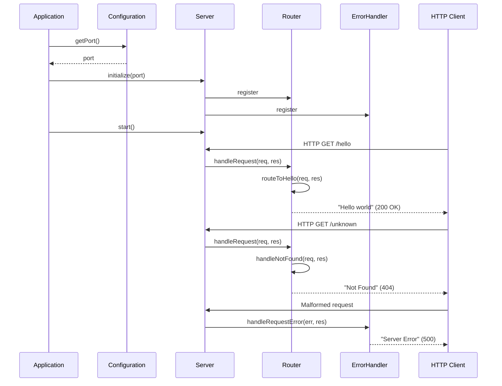
```mermaid
sequenceDiagram
    participant App as Application
    participant Config as Configuration
    participant Server as Server
    participant Router as Router
    participant ErrHandler as ErrorHandler
    participant Client as HTTP Client
    
    App->>Config: getPort()
    Config-->>App: port
    App->>Server: initialize(port)
    Server->>Router: register
    Server->>ErrHandler: register
    App->>Server: start()
    
    Client->>Server: HTTP GET /hello
    Server->>Router: handleRequest(req, res)
    Router->>Router: routeToHello(req, res)
    Router-->>Client: "Hello world" (200 OK)
    
    Client->>Server: HTTP GET /unknown
    Server->>Router: handleRequest(req, res)
    Router->>Router: handleNotFound(req, res)
    Router-->>Client: "Not Found" (404)
    
    Client->>Server: Malformed request
    Server->>ErrHandler: handleRequestError(err, res)
    ErrHandler-->>Client: "Server Error" (500)
```

### COMPONENT SPECIFICATIONS

#### Server Component

**Responsibilities:**
- Initialize the HTTP server instance
- Configure server with the correct port
- Register request handlers
- Start and stop the server
- Forward requests to the Router component
- Handle server-level errors

**Interfaces:**

| Method | Parameters | Return Value | Description |
|--------|------------|--------------|-------------|
| initialize | port (Number) | void | Creates HTTP server instance and configures it |
| start | None | Promise | Starts the server listening on configured port |
| stop | None | Promise | Gracefully stops the server |

**Events:**

| Event | Description | Data |
|-------|-------------|------|
| listening | Server has started successfully | Port number |
| error | Server encountered an error | Error object |
| request | New HTTP request received | Request and response objects |

**Error Handling:**
- Server startup errors are logged and result in process termination
- Runtime server errors are forwarded to ErrorHandler component
- Unhandled exceptions are captured to prevent crashes

#### Router Component

**Responsibilities:**
- Process incoming HTTP requests
- Route requests to appropriate handlers based on URL path
- Generate HTTP responses with correct status codes and content
- Handle 404 errors for undefined routes

**Interfaces:**

| Method | Parameters | Return Value | Description |
|--------|------------|--------------|-------------|
| handleRequest | req (IncomingMessage), res (ServerResponse) | void | Main entry point for request processing |
| routeToHello | req (IncomingMessage), res (ServerResponse) | void | Handler for /hello endpoint |
| handleNotFound | req (IncomingMessage), res (ServerResponse) | void | Handler for undefined routes |

**Supported Routes:**

| Route | HTTP Method | Response | Status Code |
|-------|------------|----------|-------------|
| /hello | GET | "Hello world" | 200 OK |
| * (all others) | * | "Not Found" | 404 Not Found |

**Error Handling:**
- Invalid routes return 404 Not Found
- Method not allowed returns 405 Method Not Allowed
- Processing errors are forwarded to ErrorHandler component

#### Configuration Component

**Responsibilities:**
- Read environment variables for configuration
- Provide default values when environment variables are not set
- Supply configuration to other components

**Interfaces:**

| Method | Parameters | Return Value | Description |
|--------|------------|--------------|-------------|
| getPort | None | Number | Returns configured port number from environment or default |

**Configuration Parameters:**

| Parameter | Environment Variable | Default Value | Description |
|-----------|----------------------|---------------|-------------|
| Port | PORT | 3000 | TCP port for HTTP server to listen on |

**Error Handling:**
- Invalid port numbers are logged with warnings and default is used
- Non-numeric port values are converted or rejected with appropriate messages

#### ErrorHandler Component

**Responsibilities:**
- Capture and log errors
- Generate appropriate error responses
- Prevent server crashes from unhandled exceptions

**Interfaces:**

| Method | Parameters | Return Value | Description |
|--------|------------|--------------|-------------|
| handleServerError | err (Error) | void | Process server-level errors |
| handleRequestError | err (Error), res (ServerResponse) | void | Process request processing errors |
| logError | err (Error) | void | Log error details to console |

**Error Types:**

| Error Type | HTTP Status | Response | Action |
|------------|-------------|----------|--------|
| Server Startup | N/A | Console log | Exit process |
| Route Not Found | 404 | "Not Found" | Continue operation |
| Method Not Allowed | 405 | "Method Not Allowed" | Continue operation |
| Request Processing | 500 | "Internal Server Error" | Continue operation |
| Unhandled Exception | 500 | "Internal Server Error" | Continue operation |

### DETAILED DESIGN

#### Server Component Design

The Server component uses Node.js built-in `http` module to create and manage an HTTP server instance:

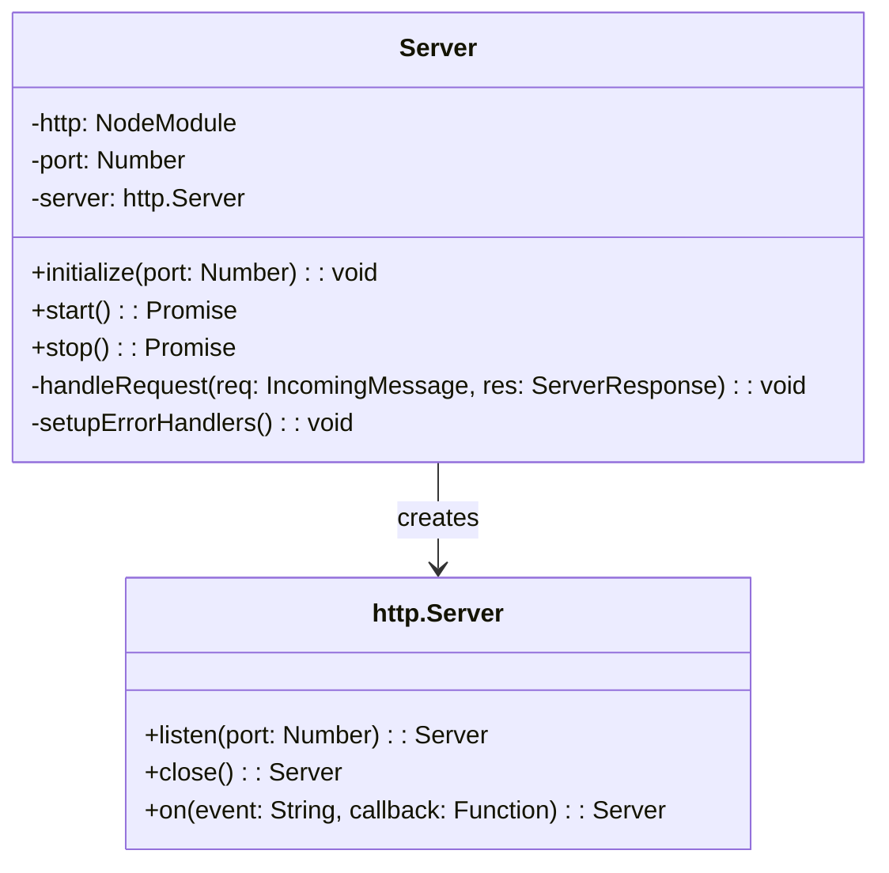
```mermaid
classDiagram
    class Server {
        -http: NodeModule
        -port: Number
        -server: http.Server
        +initialize(port: Number): void
        +start(): Promise
        +stop(): Promise
        -handleRequest(req: IncomingMessage, res: ServerResponse): void
        -setupErrorHandlers(): void
    }
    
    class http.Server {
        +listen(port: Number): Server
        +close(): Server
        +on(event: String, callback: Function): Server
    }
    
    Server --> http.Server : creates
```

**Key Design Decisions:**
- Uses callback pattern for request handling
- Implements Promise-based start/stop methods for better async control
- Delegates request processing to Router component
- Registers global error handlers to prevent crashes

#### Router Component Design

The Router component implements a simple routing mechanism to direct requests to the appropriate handler:

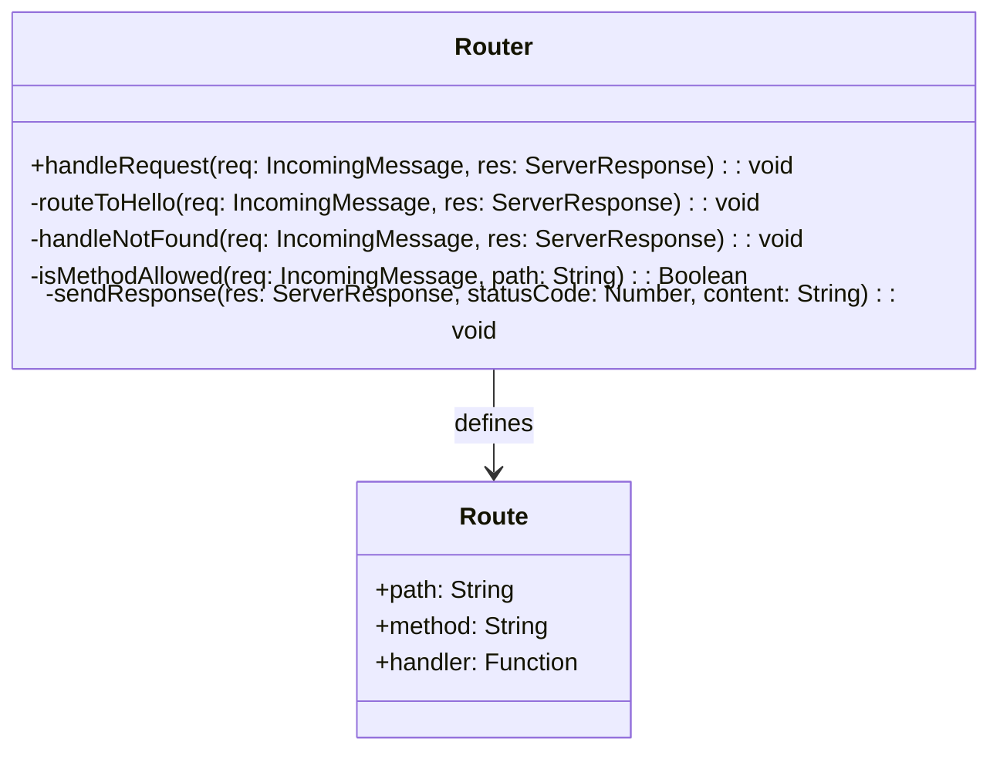
```mermaid
classDiagram
    class Router {
        +handleRequest(req: IncomingMessage, res: ServerResponse): void
        -routeToHello(req: IncomingMessage, res: ServerResponse): void
        -handleNotFound(req: IncomingMessage, res: ServerResponse): void
        -isMethodAllowed(req: IncomingMessage, path: String): Boolean
        -sendResponse(res: ServerResponse, statusCode: Number, content: String): void
    }
    
    class Route {
        +path: String
        +method: String
        +handler: Function
    }
    
    Router --> Route : defines
```

**Key Design Decisions:**
- Simple path-based routing without regular expressions
- Direct mapping of routes to handler functions
- Centralized response formatting for consistency
- Method checking to enforce HTTP method constraints

#### Configuration Component Design

The Configuration component provides a simple interface to access configuration parameters:

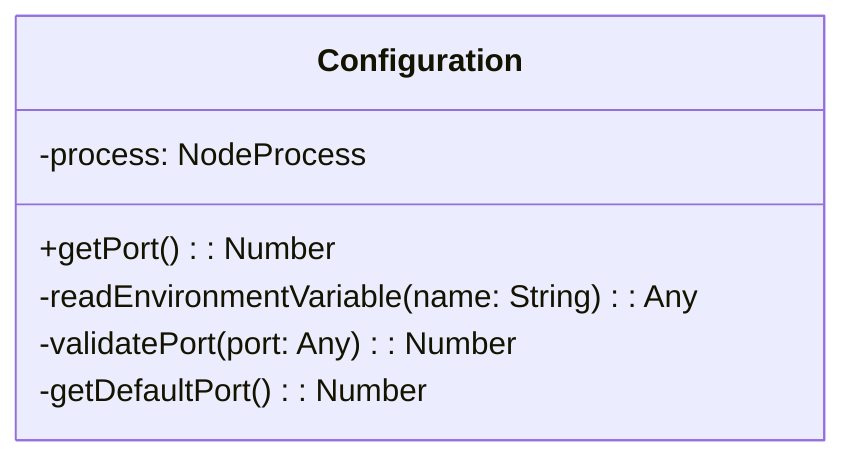
```mermaid
classDiagram
    class Configuration {
        -process: NodeProcess
        +getPort(): Number
        -readEnvironmentVariable(name: String): Any
        -validatePort(port: Any): Number
        -getDefaultPort(): Number
    }
```

**Key Design Decisions:**
- Encapsulates environment variable access
- Provides validation for configuration values
- Returns sensible defaults when configuration is missing
- Centralizes configuration logic for maintainability

#### ErrorHandler Component Design

The ErrorHandler component provides centralized error processing:

```mermaid
classDiagram
    class ErrorHandler {
        +handleServerError(err: Error): void
        +handleRequestError(err: Error, res: ServerResponse): void
        -logError(err: Error, level: String): void
        -formatErrorResponse(err: Error): String
        -determineStatusCode(err: Error): Number
    }
```

**Key Design Decisions:**
- Categorizes errors for appropriate handling
- Provides consistent error logging format
- Generates user-friendly error responses
- Prevents sensitive error details from being exposed

### INTERFACE DEFINITIONS

#### HTTP API Interface

| Endpoint | Method | Request Format | Response Format | Status Codes |
|----------|--------|----------------|-----------------|--------------|
| /hello | GET | Empty body | Plain text: "Hello world" | 200 OK |
| * (all others) | * | Any | Plain text: "Not Found" | 404 Not Found |
| * (invalid method) | * | Any | Plain text: "Method Not Allowed" | 405 Method Not Allowed |
| * (server error) | * | Any | Plain text: "Internal Server Error" | 500 Internal Server Error |

**Request Headers:**
- Standard HTTP headers are supported
- No special headers required

**Response Headers:**
- `Content-Type: text/plain`
- `Content-Length: <length of response body>`

**Sample Request/Response:**

Request:
```
GET /hello HTTP/1.1
Host: localhost:3000
```

Response:
```
HTTP/1.1 200 OK
Content-Type: text/plain
Content-Length: 11

Hello world
```

#### Internal Component Interfaces

**Server to Router Interface:**

| Method | Parameters | Return | Description |
|--------|------------|--------|-------------|
| handleRequest | req: IncomingMessage, res: ServerResponse | void | Process an HTTP request and generate response |

**Server to ErrorHandler Interface:**

| Method | Parameters | Return | Description |
|--------|------------|--------|-------------|
| handleServerError | err: Error | void | Process a server-level error |
| handleRequestError | err: Error, res: ServerResponse | void | Process a request processing error and send response |

**Server to Configuration Interface:**

| Method | Parameters | Return | Description |
|--------|------------|--------|-------------|
| getPort | None | Number | Get the configured port number |

### DESIGN PATTERNS

The application implements several design patterns appropriate for its scope:

#### Singleton Pattern

The Configuration component is implemented as a singleton to ensure consistent configuration across the application:

```mermaid
classDiagram
    class Configuration {
        -static instance: Configuration
        -constructor()
        +static getInstance(): Configuration
        +getPort(): Number
    }
```

#### Facade Pattern

The Server component provides a simplified interface to the underlying HTTP server functionality:

```mermaid
classDiagram
    class Server {
        +initialize(port: Number): void
        +start(): Promise
        +stop(): Promise
    }
    
    class HttpServer {
        +createServer(): Server
        +listen(): void
        +close(): void
        +on(): void
    }
    
    Server --> HttpServer : uses
```

#### Observer Pattern

The error handling system uses the Observer pattern through Node.js EventEmitter:

```mermaid
classDiagram
    class Server {
        +on(event: String, callback: Function): void
        +emit(event: String, data: Any): void
    }
    
    class ErrorHandler {
        +handleError(err: Error): void
    }
    
    Server --> ErrorHandler : notifies
```

#### Strategy Pattern

The Router component implements a simple Strategy pattern for handling different routes:

```mermaid
classDiagram
    class Router {
        +handleRequest(req: IncomingMessage, res: ServerResponse): void
    }
    
    class HelloHandler {
        +handle(req: IncomingMessage, res: ServerResponse): void
    }
    
    class NotFoundHandler {
        +handle(req: IncomingMessage, res: ServerResponse): void
    }
    
    Router --> HelloHandler : uses
    Router --> NotFoundHandler : uses
```

### COMPONENT DEPENDENCIES

```mermaid
flowchart TD
    A[Application Entry Point] --> B[Configuration]
    A --> C[Server]
    C --> D[Router]
    C --> E[ErrorHandler]
    D --> F[HTTP Response Utilities]
    E --> F
    
    classDef core fill:#bbf,stroke:#333,stroke-width:2px
    classDef support fill:#bfb,stroke:#333,stroke-width:1px
    classDef utility fill:#ffd,stroke:#333,stroke-width:1px
    
    class A,C,D core
    class B,E support
    class F utility
```

**Dependency Table:**

| Component | Dependencies | Dependency Type | Justification |
|-----------|--------------|-----------------|---------------|
| Application Entry | Configuration, Server | Direct | Initializes and starts the application |
| Server | http module, Router, ErrorHandler | Direct | Core server functionality |
| Router | None | None | Self-contained routing logic |
| Configuration | process.env | Direct | Reads environment variables |
| ErrorHandler | None | None | Self-contained error handling |

**Dependency Management Strategy:**
- Dependency injection for testability
- Clear separation of concerns between components
- Minimal external dependencies (only Node.js core modules)
- Loose coupling between components through well-defined interfaces

### 6.1 CORE SERVICES ARCHITECTURE

For this simple Node.js HTTP server application with a single `/hello` endpoint, a complex microservices architecture is not required. The application follows a monolithic design pattern appropriate for its minimal requirements and educational purpose.

#### SERVICE COMPONENTS

This application consists of a single service component that handles HTTP requests and responses. While not a microservice architecture, we can still describe its service characteristics:

| Component | Responsibility |
|-----------|---------------|
| HTTP Server | Listens for incoming HTTP requests, routes to the `/hello` endpoint handler, and returns responses |
| Request Handler | Processes requests to the `/hello` endpoint and generates "Hello world" responses |

**Communication Pattern:**

The application uses a simple synchronous request-response pattern within a single process:

```mermaid
sequenceDiagram
    participant Client as HTTP Client
    participant Server as Node.js HTTP Server
    participant Handler as Request Handler
    
    Client->>Server: HTTP GET /hello
    Server->>Handler: Process request
    Handler-->>Server: "Hello world" response
    Server-->>Client: 200 OK with "Hello world"
```

Since this is a single-service application, the following enterprise service patterns are not applicable:
- Service discovery mechanisms
- Inter-service communication protocols
- Load balancing between services
- Circuit breaker patterns
- Complex retry and fallback mechanisms

#### SCALABILITY DESIGN

While the application is simple, we can still define a scalability approach for handling increased load:

| Scaling Approach | Implementation |
|------------------|----------------|
| Horizontal Scaling | Deploy multiple instances behind a load balancer |
| Vertical Scaling | Increase CPU/memory resources for the Node.js process |

**Scaling Strategy:**

```mermaid
flowchart TD
    Client[HTTP Clients] --> LB[Load Balancer]
    LB --> S1[Server Instance 1]
    LB --> S2[Server Instance 2]
    LB --> S3[Server Instance 3]
    
    classDef client fill:#f9f,stroke:#333,stroke-width:2px
    classDef lb fill:#ffd,stroke:#333,stroke-width:2px
    classDef server fill:#bbf,stroke:#333,stroke-width:2px
    
    class Client client
    class LB lb
    class S1,S2,S3 server
```

**Performance Considerations:**

| Technique | Description |
|-----------|-------------|
| Node.js Clustering | Utilize the Node.js cluster module to create worker processes |
| Connection Pooling | Implement connection reuse for frequent client connections |
| Response Caching | Cache the "Hello world" response (though benefit is minimal) |

**Capacity Planning Guidelines:**

For this simple application:
- Each Node.js instance can typically handle thousands of concurrent connections
- Memory footprint is minimal (< 100MB per instance)
- CPU utilization will be low for this simple endpoint
- Network bandwidth requirements are minimal

#### RESILIENCE PATTERNS

Even for a simple application, basic resilience patterns can be implemented:

| Resilience Pattern | Implementation |
|--------------------|----------------|
| Error Handling | Proper try/catch blocks and unhandled exception handling |
| Process Monitoring | Use process managers like PM2 to auto-restart on failure |
| Health Checks | Implement a basic health check endpoint |

**Resilience Implementation:**

```mermaid
flowchart TD
    A[Process Manager] --> B[Node.js Server]
    B -->|Crash| A
    A -->|Restart| B
    C[Health Monitor] -->|Check| D[/health Endpoint]
    D --> B
    
    classDef manager fill:#ffd,stroke:#333,stroke-width:2px
    classDef server fill:#bbf,stroke:#333,stroke-width:2px
    classDef monitor fill:#bfb,stroke:#333,stroke-width:1px
    
    class A manager
    class B server
    class C,D monitor
```

**Fault Tolerance Approach:**

| Mechanism | Description |
|-----------|-------------|
| Graceful Shutdown | Handle SIGTERM/SIGINT signals to close connections properly |
| Request Timeout | Implement request timeout handling |
| Logging | Basic error logging for troubleshooting |

**Service Degradation:**

For this simple application, service degradation is not applicable as there are no tiered service levels or complex features that could be selectively disabled under load.

#### SIMPLIFIED ARCHITECTURE SUMMARY

This Node.js Hello World application uses a simple monolithic architecture appropriate for its educational purpose. While enterprise patterns like microservices, complex service discovery, and advanced resilience mechanisms are not required, the application can still benefit from basic scaling and resilience practices if deployed beyond a learning environment.

The architecture prioritizes:
- Simplicity and educational value
- Minimal dependencies
- Clear separation of concerns
- Appropriate error handling

This approach aligns with the project's goal of providing a minimal, functional example of a Node.js web service that can serve as a learning tool or starter template.

### 6.2 DATABASE DESIGN

Database Design is not applicable to this system. The Node.js Hello World application with a single `/hello` endpoint that returns "Hello world" to HTTP clients does not require any persistent data storage for the following reasons:

1. **Stateless Operation**: The application operates in a completely stateless manner, with no need to persist information between requests.

2. **No Data Management Requirements**: The application simply returns a static "Hello world" string without any dynamic data that would need to be stored or retrieved.

3. **No User Data**: The system does not collect, process, or store any user information that would require database storage.

4. **No Configuration Storage**: All configuration (such as the port number) is handled through environment variables or defaults in the code, not requiring persistent storage.

5. **No Logging Database**: While the application may generate logs, these are typically written to the console or files rather than a database in this simple implementation.

6. **No Authentication/Authorization**: The application does not implement user authentication or authorization that would require user records or session storage.

7. **No Metrics Storage**: Any performance metrics or monitoring would be handled by external systems rather than within the application itself.

If future enhancements were to require data persistence (such as request logging, user tracking, or dynamic content), a database design would need to be developed at that time. Potential future database needs could include:

- Request logging for analytics
- User session management if authentication were added
- Configuration management for more complex deployments
- Content management if dynamic responses were implemented

For the current requirements, the application maintains its simplicity and educational value by avoiding unnecessary database dependencies.

### 6.3 INTEGRATION ARCHITECTURE

For this simple Node.js HTTP server application with a single `/hello` endpoint, a comprehensive integration architecture is largely not applicable. The system is designed as a standalone service with minimal integration requirements. However, we can document the basic API design that allows HTTP clients to interact with the server.

#### API DESIGN

##### Protocol Specifications

| Aspect | Specification |
|--------|---------------|
| Protocol | HTTP/1.1 |
| Transport | TCP |
| Data Format | Plain text |
| Endpoint URL | `/hello` |

##### API Endpoints

| Endpoint | Method | Description | Response |
|----------|--------|-------------|----------|
| `/hello` | GET | Returns a greeting message | "Hello world" (200 OK) |

##### Authentication Methods

Authentication is not implemented for this simple application. The `/hello` endpoint is publicly accessible without any authentication requirements.

##### Authorization Framework

Authorization is not applicable for this application. There are no protected resources or different access levels that would require authorization controls.

##### Rate Limiting Strategy

Rate limiting is not implemented in this basic version. For a production deployment, rate limiting could be added using:
- HTTP headers (429 Too Many Requests)
- IP-based request counting
- Token bucket algorithm

##### Versioning Approach

API versioning is not implemented as this is a simple, single-endpoint application. For future extensions, the following versioning strategies could be considered:
- URL path versioning (e.g., `/v1/hello`)
- Header-based versioning (e.g., `Accept: application/vnd.example.v1+json`)
- Query parameter versioning (e.g., `/hello?version=1`)

##### Documentation Standards

For this simple application, documentation is minimal and includes:
- README.md with usage instructions
- Comments in the source code
- This technical specification document

```mermaid
flowchart LR
    Client[HTTP Client] <-->|HTTP/1.1 GET /hello| Server[Node.js HTTP Server]
    Server -->|"Hello world"| Client
    
    classDef client fill:#f9f,stroke:#333,stroke-width:2px
    classDef server fill:#bbf,stroke:#333,stroke-width:2px
    
    class Client client
    class Server server
```

#### MESSAGE PROCESSING

Message processing patterns are not applicable to this simple HTTP server application. The application uses a straightforward request-response pattern without:
- Event processing
- Message queues
- Stream processing
- Batch processing

The request-response flow is synchronous and direct:

```mermaid
sequenceDiagram
    participant Client as HTTP Client
    participant Server as Node.js Server
    
    Client->>Server: HTTP GET /hello
    Note right of Server: Process request
    Server-->>Client: "Hello world" (200 OK)
```

##### Error Handling Strategy

The error handling strategy for this simple application includes:

| Error Type | Handling Approach |
|------------|-------------------|
| Invalid Routes | Return 404 Not Found |
| Server Errors | Return 500 Internal Server Error |
| Startup Errors | Log to console and exit process |

```mermaid
flowchart TD
    A[HTTP Request] --> B{Valid Route?}
    B -->|Yes| C[Process Request]
    B -->|No| D[Return 404]
    C --> E{Processing Error?}
    E -->|No| F[Return 200 with Response]
    E -->|Yes| G[Return 500]
    
    classDef process fill:#bfb,stroke:#333,stroke-width:1px
    classDef error fill:#fbb,stroke:#333,stroke-width:1px
    classDef decision fill:#ffd,stroke:#333,stroke-width:1px
    classDef response fill:#bbf,stroke:#333,stroke-width:1px
    
    class A,C process
    class D,G error
    class B,E decision
    class F response
```

#### EXTERNAL SYSTEMS

This application does not integrate with any external systems or services. It operates as a standalone HTTP server without dependencies on:
- Third-party APIs
- Legacy systems
- External databases
- Authentication providers
- API gateways

If future enhancements required external integrations, this section would document:
- Integration patterns and protocols
- Service contracts
- Data mapping requirements
- Security considerations
- Resilience patterns

#### INTEGRATION SUMMARY

This Node.js Hello World application is intentionally designed as a standalone service with minimal integration requirements. It exposes a simple HTTP endpoint that clients can interact with using standard HTTP requests. The application does not require complex integration patterns, message processing, or external system dependencies.

This simplicity aligns with the educational purpose of the application, providing a clear example of basic HTTP server implementation in Node.js without the complexity of extensive integration requirements.

### 6.4 SECURITY ARCHITECTURE

Detailed Security Architecture is not applicable for this system. The Node.js Hello World application with a single `/hello` endpoint that returns "Hello world" to HTTP clients is intentionally designed as a minimal educational example without authentication, authorization, or sensitive data handling requirements.

#### STANDARD SECURITY PRACTICES

While a comprehensive security architecture is not required, the following standard security practices will be implemented:

| Security Practice | Implementation Approach | Purpose |
|-------------------|-------------------------|---------|
| Input Validation | Validate HTTP method and path | Prevent unexpected behavior from malformed requests |
| Error Handling | Avoid exposing system details in error messages | Prevent information disclosure |
| HTTP Headers | Set appropriate security headers | Enhance browser security for clients |
| Dependency Management | Use secure Node.js version | Prevent known vulnerabilities |

#### SECURITY CONSIDERATIONS

##### Server Hardening

| Hardening Measure | Description | Implementation |
|-------------------|-------------|----------------|
| Port Configuration | Use non-privileged ports | Configure server to use port 3000 or higher |
| Process Isolation | Run with minimal privileges | Avoid running as root/administrator |
| Resource Limits | Prevent resource exhaustion | Implement request size limits |
| Timeouts | Prevent hanging connections | Set appropriate request timeouts |

##### HTTP Security Headers

The application will implement basic security headers for HTTP responses:

| Header | Value | Purpose |
|--------|-------|---------|
| X-Content-Type-Options | nosniff | Prevent MIME type sniffing |
| X-Frame-Options | DENY | Prevent clickjacking attacks |
| Content-Security-Policy | default-src 'self' | Mitigate XSS risks |
| Cache-Control | no-store | Prevent response caching |

##### Security Monitoring

For production deployments, the following monitoring practices are recommended:

| Monitoring Type | Approach | Benefit |
|-----------------|----------|---------|
| Access Logging | Log request metadata | Detect unusual access patterns |
| Error Logging | Log application errors | Identify potential attacks |
| Resource Monitoring | Track CPU/memory usage | Detect DoS conditions |

#### SECURITY ZONES

While the application is simple, we can still define basic security zones:

```mermaid
flowchart TD
    A[Internet] -->|HTTP Request| B[Public Zone]
    B -->|Request Validation| C[Application Zone]
    C -->|Processing| D[Response Generation]
    D -->|HTTP Response| B
    B -->|HTTP Response| A
    
    classDef internet fill:#f9f,stroke:#333,stroke-width:2px
    classDef public fill:#fbb,stroke:#333,stroke-width:1px
    classDef app fill:#bbf,stroke:#333,stroke-width:2px
    
    class A internet
    class B public
    class C,D app
```

#### SECURITY FLOW

Basic request processing security flow:

```mermaid
sequenceDiagram
    participant Client as HTTP Client
    participant Server as Node.js Server
    participant Validator as Request Validator
    participant Handler as Request Handler
    
    Client->>Server: HTTP Request
    Server->>Validator: Validate Request
    
    alt Valid Request
        Validator->>Handler: Process Request
        Handler->>Server: Generate Response
        Server->>Client: Return "Hello world" (200 OK)
    else Invalid Request
        Validator->>Server: Reject Request
        Server->>Client: Return Error (4xx)
    end
```

#### SECURITY RECOMMENDATIONS FOR PRODUCTION

If this application were to be deployed in a production environment, the following additional security measures would be recommended:

| Category | Recommendation | Benefit |
|----------|----------------|---------|
| Transport Security | Implement HTTPS | Encrypt data in transit |
| Rate Limiting | Add request rate controls | Prevent DoS attacks |
| Logging | Implement structured logging | Enable security monitoring |
| Containerization | Deploy in containers | Improve isolation |
| Updates | Regular dependency updates | Address security vulnerabilities |

#### SECURITY COMPLIANCE

For educational applications like this, formal compliance requirements are typically not applicable. However, if deployed in a production environment, the following compliance considerations may apply:

| Compliance Area | Consideration | Applicability |
|-----------------|---------------|---------------|
| Data Privacy | No personal data collection | GDPR/CCPA not applicable |
| Accessibility | Simple text response | Minimal accessibility concerns |
| Industry Standards | Follow OWASP guidelines | Basic web security practices |

This simple Node.js Hello World application intentionally minimizes security complexity to focus on educational value. The security practices outlined above provide a reasonable baseline for this type of application while acknowledging that a comprehensive security architecture is not required for this specific use case.

### 6.5 MONITORING AND OBSERVABILITY

Detailed Monitoring Architecture is not applicable for this system. The Node.js Hello World application with a single `/hello` endpoint is intentionally designed as a minimal educational example that doesn't require comprehensive monitoring and observability infrastructure. However, basic monitoring practices will be implemented to ensure proper operation and provide a foundation for understanding monitoring concepts.

#### BASIC MONITORING APPROACH

| Monitoring Area | Implementation | Purpose |
|-----------------|----------------|---------|
| Health Checks | Simple endpoint to verify server status | Confirm application is running and responsive |
| Console Logging | Standard output/error logging | Capture startup, requests, and errors |
| Process Monitoring | Basic Node.js process metrics | Track memory usage and CPU utilization |

#### HEALTH CHECK IMPLEMENTATION

A basic health check endpoint will be added to complement the `/hello` endpoint:

| Endpoint | Method | Response | Purpose |
|----------|--------|----------|---------|
| `/health` | GET | Status JSON | Verify server is operational |

The health check response will include:
- Server uptime
- Memory usage
- Request count since startup

```mermaid
flowchart TD
    A[Monitoring Tool] -->|GET /health| B[Node.js Server]
    B -->|Status JSON| A
    C[HTTP Client] -->|GET /hello| B
    B -->|"Hello world"| C
    
    classDef monitor fill:#bfb,stroke:#333,stroke-width:1px
    classDef server fill:#bbf,stroke:#333,stroke-width:2px
    classDef client fill:#f9f,stroke:#333,stroke-width:2px
    
    class A monitor
    class B server
    class C client
```

#### BASIC METRICS COLLECTION

For educational purposes, the application will track these fundamental metrics:

| Metric | Description | Collection Method |
|--------|-------------|------------------|
| Request Count | Total number of requests processed | In-memory counter |
| Response Time | Time to process requests (ms) | Request-response timing |
| Error Count | Number of failed requests | In-memory counter |
| Memory Usage | Node.js process memory consumption | process.memoryUsage() |

#### SIMPLIFIED LOGGING STRATEGY

The application will implement a basic logging approach:

| Log Level | Usage | Example |
|-----------|-------|---------|
| INFO | Server startup, requests | "Server started on port 3000" |
| ERROR | Request failures, exceptions | "Error processing request: {details}" |
| DEBUG | Detailed processing information | "Request received for /hello endpoint" |

```mermaid
flowchart LR
    A[Application Events] -->|Generate| B[Console Logs]
    B -->|Capture| C[Terminal/Log Files]
    
    classDef events fill:#ffd,stroke:#333,stroke-width:1px
    classDef logs fill:#bbf,stroke:#333,stroke-width:2px
    classDef output fill:#bfb,stroke:#333,stroke-width:1px
    
    class A events
    class B logs
    class C output
```

#### RECOMMENDED MONITORING EXTENSIONS

For deployments beyond educational use, these monitoring extensions are recommended:

| Extension | Purpose | Implementation Approach |
|-----------|---------|-------------------------|
| Structured Logging | Improve log parsing and analysis | Use a logging library like Winston or Pino |
| Metrics Exposure | Enable external monitoring systems | Add a /metrics endpoint with Prometheus format |
| Process Manager | Automatic restarts and basic monitoring | Implement PM2 for process management |

#### BASIC OBSERVABILITY PATTERNS

Even for this simple application, basic observability patterns can be implemented:

| Pattern | Implementation | Benefit |
|---------|----------------|---------|
| Health Checks | `/health` endpoint | Verify application availability |
| Request Logging | Log request method, path, status, time | Track usage patterns and errors |
| Error Tracking | Capture and log all exceptions | Identify and troubleshoot issues |

```mermaid
sequenceDiagram
    participant Client as HTTP Client
    participant Server as Node.js Server
    participant Logger as Console Logger
    
    Client->>Server: GET /hello
    Server->>Logger: Log request details
    Server->>Client: Return "Hello world"
    Server->>Logger: Log response details
    
    alt Error Occurs
        Server->>Logger: Log detailed error
        Server->>Client: Return error response
    end
```

#### SIMPLIFIED DASHBOARD CONCEPT

For educational purposes, a simple dashboard could display:

```mermaid
flowchart TD
    subgraph "Node.js Hello World Dashboard"
        A[Server Status: UP/DOWN]
        B[Uptime: 1d 2h 34m]
        C[Total Requests: 1,234]
        D[Error Rate: 0.1%]
        E[Memory Usage: 42MB]
        F[Avg Response Time: 5ms]
    end
    
    classDef status fill:#9f9,stroke:#333,stroke-width:1px
    classDef metrics fill:#bbf,stroke:#333,stroke-width:1px
    
    class A status
    class B,C,D,E,F metrics
```

#### INCIDENT RESPONSE GUIDELINES

For production deployments, these basic incident response practices are recommended:

| Practice | Description | Implementation |
|----------|-------------|----------------|
| Monitoring | Regular health check polling | Configure external monitoring service |
| Alerting | Notification on server down | Email/SMS alerts for failures |
| Recovery | Automatic restart procedure | Process manager restart policy |
| Documentation | Basic troubleshooting steps | Simple runbook for common issues |

#### CONCLUSION

While this simple Node.js Hello World application doesn't require sophisticated monitoring and observability infrastructure, implementing these basic practices provides:

1. Educational value for understanding monitoring concepts
2. A foundation for more advanced monitoring if the application evolves
3. Basic operational visibility for troubleshooting
4. Demonstration of monitoring best practices at a minimal level

These simplified monitoring approaches align with the educational purpose of the application while ensuring basic operational visibility.

### 6.6 TESTING STRATEGY

While this Node.js Hello World application is intentionally simple, implementing a structured testing approach ensures reliability and provides a foundation for future enhancements. The testing strategy will focus on verifying the core functionality of the HTTP server and `/hello` endpoint.

#### TESTING APPROACH

##### Unit Testing

| Framework/Tool | Version | Purpose |
|----------------|---------|---------|
| Jest | 29.x | Primary testing framework for unit tests |
| Supertest | 6.x | HTTP assertion library for endpoint testing |

**Test Organization Structure:**

```
/tests
  /unit
    server.test.js    # Tests for server initialization
    router.test.js    # Tests for request routing
    config.test.js    # Tests for configuration handling
    error.test.js     # Tests for error handling
```

**Mocking Strategy:**

| Component to Mock | Mocking Approach | Purpose |
|-------------------|------------------|---------|
| HTTP Server | Jest mock functions | Isolate server initialization logic |
| Environment Variables | Jest mock of process.env | Test configuration handling |
| Error Events | Event simulation | Test error handling paths |

**Code Coverage Requirements:**

| Component | Coverage Target | Critical Paths |
|-----------|-----------------|---------------|
| Server | 90% | Server initialization, request handling |
| Router | 95% | Route matching, response generation |
| Configuration | 90% | Environment variable processing |
| Error Handler | 95% | All error handling paths |

**Test Naming Conventions:**

```
describe('Component: Feature', () => {
  it('should behave in a certain way when something happens', () => {
    // Test implementation
  });
});
```

**Example Unit Test Pattern:**

```
// Testing the /hello endpoint
describe('Router: Hello Endpoint', () => {
  it('should return "Hello world" with 200 status code', async () => {
    // Test implementation using supertest
  });
  
  it('should return text/plain content type', async () => {
    // Test implementation
  });
});
```

**Test Data Management:**

For this simple application, test data needs are minimal. Static expected values (like "Hello world") will be defined as constants in the test files.

##### Integration Testing

| Framework/Tool | Version | Purpose |
|----------------|---------|---------|
| Supertest | 6.x | HTTP server integration testing |
| Node.js http | Built-in | Manual HTTP client for testing |

**API Testing Strategy:**

| Test Category | Test Approach | Validation Criteria |
|---------------|---------------|---------------------|
| Happy Path | GET request to `/hello` | Status 200, body "Hello world" |
| Error Path | GET request to undefined route | Status 404 |
| Method Validation | POST request to `/hello` | Status 405 (if implemented) |

**Test Environment Management:**

Tests will run against an isolated server instance started specifically for testing, using a random available port to avoid conflicts.

```mermaid
flowchart TD
    A[Start Test Suite] --> B[Initialize Test Server]
    B --> C[Run API Tests]
    C --> D[Shutdown Test Server]
    D --> E[Report Results]
    
    classDef start fill:#9f9,stroke:#333,stroke-width:2px
    classDef process fill:#bbf,stroke:#333,stroke-width:1px
    classDef endNode fill:#ffd,stroke:#333,stroke-width:2px
    
    class A start
    class B,C,D process
    class E endNode
```

##### End-to-End Testing

For this simple application, comprehensive end-to-end testing is not required. However, basic E2E verification will include:

| Test Scenario | Test Approach | Validation Criteria |
|---------------|---------------|---------------------|
| Server Startup | Start server process | Process starts without errors |
| Endpoint Access | HTTP request from external client | Receives "Hello world" response |
| Server Shutdown | Send shutdown signal | Process terminates gracefully |

**Performance Testing Requirements:**

Basic performance benchmarks will verify the server can handle a reasonable load:

| Metric | Target | Test Approach |
|--------|--------|---------------|
| Response Time | < 50ms (avg) | 100 sequential requests |
| Throughput | > 1000 req/sec | Simple load test with autocannon |
| Stability | No crashes | 1-minute sustained load test |

#### TEST AUTOMATION

| Tool | Purpose | Integration Point |
|------|---------|-------------------|
| GitHub Actions | CI/CD automation | Repository workflow |
| npm scripts | Test execution | package.json |

**Automated Test Triggers:**

| Trigger | Test Scope | Action |
|---------|------------|--------|
| Pull Request | All tests | Block merge on failure |
| Push to main | All tests | Report status |
| Manual trigger | Performance tests | Report results |

**Test Reporting Requirements:**

| Report Type | Format | Distribution |
|-------------|--------|--------------|
| Test Results | JUnit XML | CI/CD dashboard |
| Coverage Report | HTML, lcov | Repository artifacts |

**Failed Test Handling:**

```mermaid
flowchart TD
    A[Test Execution] --> B{Tests Pass?}
    B -->|Yes| C[Report Success]
    B -->|No| D[Capture Failure Details]
    D --> E[Generate Failure Report]
    E --> F[Fail CI/CD Pipeline]
    
    classDef process fill:#bbf,stroke:#333,stroke-width:1px
    classDef decision fill:#ffd,stroke:#333,stroke-width:1px
    classDef success fill:#9f9,stroke:#333,stroke-width:2px
    classDef failure fill:#fbb,stroke:#333,stroke-width:2px
    
    class A process
    class B decision
    class C success
    class D,E,F failure
```

#### QUALITY METRICS

| Metric | Target | Enforcement |
|--------|--------|-------------|
| Code Coverage | ≥ 90% overall | CI/CD quality gate |
| Test Success Rate | 100% | Block deployment on failure |
| Lint Violations | 0 | CI/CD quality gate |
| Performance Thresholds | Response time < 50ms | Warning on violation |

**Documentation Requirements:**

| Documentation | Content | Location |
|---------------|---------|----------|
| Test README | Setup and execution instructions | /tests/README.md |
| Coverage Reports | HTML coverage visualization | /coverage/index.html |
| Test Examples | Sample test patterns | /tests/examples |

#### TEST ENVIRONMENT ARCHITECTURE

```mermaid
flowchart TD
    subgraph "CI Environment"
        A[GitHub Actions Runner]
        B[Node.js Runtime]
        C[Test Execution]
        D[Coverage Collection]
    end
    
    subgraph "Test Server"
        E[Node.js HTTP Server]
        F[Hello Endpoint]
    end
    
    subgraph "Test Client"
        G[Supertest]
        H[HTTP Requests]
    end
    
    A --> B
    B --> C
    C --> G
    G --> H
    H --> E
    E --> F
    F --> H
    C --> D
    
    classDef ci fill:#ffd,stroke:#333,stroke-width:1px
    classDef server fill:#bbf,stroke:#333,stroke-width:2px
    classDef client fill:#bfb,stroke:#333,stroke-width:1px
    
    class A,B,C,D ci
    class E,F server
    class G,H client
```

#### TEST EXECUTION FLOW

```mermaid
sequenceDiagram
    participant Dev as Developer
    participant CI as CI/CD Pipeline
    participant Test as Test Runner
    participant Server as HTTP Server
    
    Dev->>CI: Push code
    CI->>Test: Initialize tests
    Test->>Server: Start test server
    Test->>Server: Send GET /hello
    Server->>Test: Return "Hello world"
    Test->>Test: Assert response
    Test->>Server: Send GET /unknown
    Server->>Test: Return 404
    Test->>Test: Assert error response
    Test->>Server: Stop test server
    Test->>CI: Report results
    CI->>Dev: Notify status
```

#### SECURITY TESTING

Even for this simple application, basic security testing will be implemented:

| Security Test | Approach | Tool |
|---------------|----------|------|
| Dependency Scanning | Check for vulnerable dependencies | npm audit |
| HTTP Header Validation | Verify security headers | Custom tests |
| Input Validation | Test with malformed requests | Custom tests |

#### RESOURCE REQUIREMENTS

| Resource | Specification | Purpose |
|----------|--------------|---------|
| CI Environment | Node.js 18.x LTS | Test execution |
| Memory | 512MB minimum | Test process |
| Storage | 1GB available | Test artifacts |
| Network | Internet access | Dependency installation |

#### IMPLEMENTATION EXAMPLES

**Unit Test Example (Jest):**

```
// Example test for the /hello endpoint
describe('Hello Endpoint', () => {
  let server;
  
  beforeEach(() => {
    server = require('../src/server');
  });
  
  afterEach(() => {
    server.close();
  });
  
  it('should return Hello world with 200 status', async () => {
    const response = await request(server).get('/hello');
    expect(response.status).toBe(200);
    expect(response.text).toBe('Hello world');
    expect(response.headers['content-type']).toContain('text/plain');
  });
});
```

**Integration Test Example (Supertest):**

```
// Example integration test
describe('Server Integration', () => {
  let server;
  
  beforeAll(async () => {
    server = await startServer(0); // Random port
  });
  
  afterAll(async () => {
    await stopServer(server);
  });
  
  it('should handle requests to /hello endpoint', async () => {
    const response = await request(server).get('/hello');
    expect(response.status).toBe(200);
    expect(response.text).toBe('Hello world');
  });
  
  it('should return 404 for undefined routes', async () => {
    const response = await request(server).get('/undefined');
    expect(response.status).toBe(404);
  });
});
```

This testing strategy provides a comprehensive approach for ensuring the reliability and correctness of the Node.js Hello World application while maintaining proportionality to the application's simplicity and educational purpose.

## 7. USER INTERFACE DESIGN

No user interface required.

This Node.js Hello World application is a backend HTTP server that exposes a single REST endpoint `/hello` which returns "Hello world" to HTTP clients. The application is designed to be interacted with programmatically via HTTP requests rather than through a graphical user interface.

Users will interact with the application by:
1. Making HTTP GET requests to the `/hello` endpoint
2. Receiving plain text "Hello world" responses

For testing and demonstration purposes, users can interact with the endpoint using:
- Command-line tools like curl or wget
- API testing tools like Postman or Insomnia
- Web browsers by navigating to the endpoint URL
- Programmatic HTTP clients in various languages

The application focuses on backend functionality and does not require any frontend user interface components.

## 8. INFRASTRUCTURE

### DEPLOYMENT ENVIRONMENT

#### Target Environment Assessment

| Aspect | Specification |
|--------|---------------|
| Environment Type | Local development environment |
| Geographic Distribution | Single instance, no distribution requirements |
| Resource Requirements | Minimal: 1 CPU core, 256MB RAM, 50MB storage |
| Compliance Requirements | None for educational/development purposes |

This Node.js Hello World application is designed as a minimal educational example that can run on virtually any environment with Node.js installed. The application has extremely modest resource requirements and can run effectively on developer workstations, small virtual machines, or entry-level cloud instances.

#### Environment Management

| Aspect | Approach |
|--------|----------|
| Infrastructure as Code | Simple npm scripts for consistent startup |
| Configuration Management | Environment variables for port configuration |
| Environment Promotion | Manual deployment suitable for this simple application |
| Backup & Recovery | Source code version control serves as primary backup |

For this simple application, sophisticated environment management is not required. The application can be started with a simple `node server.js` command, and configuration is limited to a single PORT environment variable with sensible defaults.

```mermaid
flowchart TD
    A[Developer Workstation] -->|git clone| B[Source Code]
    B -->|npm install| C[Dependencies]
    C -->|node server.js| D[Running Application]
    D -->|PORT=8080 node server.js| E[Custom Port Configuration]
    
    classDef env fill:#bbf,stroke:#333,stroke-width:2px
    classDef code fill:#bfb,stroke:#333,stroke-width:1px
    classDef running fill:#ffd,stroke:#333,stroke-width:1px
    
    class A env
    class B,C code
    class D,E running
```

### CLOUD SERVICES

For this simple Node.js Hello World application, cloud services are not required but can be utilized if desired. The application can run effectively on:

1. Local development environments
2. Basic cloud virtual machines
3. Serverless platforms (with minor adaptations)

If cloud deployment is desired, the following minimal configuration would be sufficient:

| Cloud Provider | Service Type | Specifications | Purpose |
|----------------|--------------|----------------|---------|
| Any major provider | Virtual machine or app service | Smallest available tier | Hosting Node.js application |

**Cost Optimization:**
- Use free tier offerings where available
- Utilize serverless options for intermittent usage
- Consider container-based deployment for density

### CONTAINERIZATION

While not required for this simple application, containerization can provide deployment consistency and isolation. A basic Docker configuration would include:

| Aspect | Specification |
|--------|---------------|
| Base Image | node:18-alpine (minimal size) |
| Exposed Port | 3000 (configurable via environment) |
| Image Size | Approximately 150MB |
| Build Strategy | Multi-stage build not required for this simple app |

**Example Dockerfile:**
```
FROM node:18-alpine
WORKDIR /app
COPY package*.json ./
RUN npm install --production
COPY . .
EXPOSE 3000
CMD ["node", "server.js"]
```

### ORCHESTRATION

Orchestration is not required for this simple application. The Node.js Hello World server is designed to run as a single instance and does not require the complexity of container orchestration platforms like Kubernetes.

For production applications that evolve beyond this simple example, orchestration could be considered to provide:
- High availability through multiple instances
- Automated scaling based on load
- Self-healing capabilities
- Rolling updates

### CI/CD PIPELINE

A simple CI/CD pipeline can be implemented for this application using GitHub Actions or similar platforms:

#### Build Pipeline

| Stage | Purpose | Tools |
|-------|---------|-------|
| Checkout | Retrieve source code | Git |
| Install | Install dependencies | npm |
| Lint | Verify code quality | ESLint |
| Test | Run unit tests | Jest |
| Build | Package application | npm |

#### Deployment Pipeline

| Stage | Purpose | Approach |
|-------|---------|----------|
| Deploy | Deploy application | Simple file copy or container deployment |
| Verify | Confirm deployment success | HTTP health check |
| Rollback | Revert if needed | Previous version restoration |

```mermaid
flowchart TD
    A[Source Code] -->|Commit| B[GitHub Repository]
    B -->|Trigger| C[CI/CD Pipeline]
    
    subgraph "CI Pipeline"
        D[Install Dependencies]
        E[Run Linting]
        F[Execute Tests]
        G[Build Package]
    end
    
    subgraph "CD Pipeline"
        H[Deploy to Environment]
        I[Verify Deployment]
        J{Successful?}
        K[Notify Success]
        L[Rollback]
    end
    
    C --> D
    D --> E
    E --> F
    F --> G
    G --> H
    H --> I
    I --> J
    J -->|Yes| K
    J -->|No| L
    
    classDef repo fill:#bbf,stroke:#333,stroke-width:2px
    classDef ci fill:#bfb,stroke:#333,stroke-width:1px
    classDef cd fill:#ffd,stroke:#333,stroke-width:1px
    classDef decision fill:#f9f,stroke:#333,stroke-width:1px
    
    class A,B repo
    class D,E,F,G ci
    class H,I,K,L cd
    class J decision
```

### INFRASTRUCTURE MONITORING

For this simple application, extensive monitoring infrastructure is not required. However, basic monitoring can be implemented:

| Monitoring Type | Approach | Tools |
|-----------------|----------|-------|
| Application Health | HTTP health check endpoint | Any HTTP monitoring tool |
| Resource Usage | Basic CPU/memory monitoring | Node.js process metrics |
| Logs | Console output capture | Standard logging tools |
| Uptime | Periodic endpoint polling | Simple uptime monitors |

**Recommended Monitoring Metrics:**

| Metric | Description | Threshold |
|--------|-------------|-----------|
| Availability | Server uptime percentage | >99.9% |
| Response Time | Time to serve /hello requests | <100ms |
| Error Rate | Percentage of failed requests | <0.1% |
| Memory Usage | Node.js process memory consumption | <200MB |

### RESOURCE SIZING GUIDELINES

| Environment | CPU | Memory | Storage | Network |
|-------------|-----|--------|---------|---------|
| Development | 1 core | 256MB | 100MB | Minimal |
| Production | 1-2 cores | 512MB | 1GB | 5 Mbps |

These guidelines are intentionally minimal as the application has very modest resource requirements. The Node.js Hello World server can handle thousands of requests per second on even the smallest cloud instances or containers.

### INFRASTRUCTURE ARCHITECTURE DIAGRAM

```mermaid
flowchart TD
    A[HTTP Clients] -->|HTTP Requests| B[Load Balancer]
    B -->|Forward Requests| C[Node.js Server]
    C -->|Read| D[Environment Variables]
    C -->|Write| E[Console Logs]
    F[Monitoring System] -->|Health Checks| C
    
    subgraph "Host Environment"
        C
        D
        E
    end
    
    classDef client fill:#f9f,stroke:#333,stroke-width:2px
    classDef infra fill:#ffd,stroke:#333,stroke-width:1px
    classDef app fill:#bbf,stroke:#333,stroke-width:2px
    classDef storage fill:#bfb,stroke:#333,stroke-width:1px
    classDef monitor fill:#fbb,stroke:#333,stroke-width:1px
    
    class A client
    class B infra
    class C app
    class D,E storage
    class F monitor
```

### DEPLOYMENT WORKFLOW DIAGRAM

```mermaid
flowchart TD
    A[Developer] -->|Commit Code| B[Git Repository]
    B -->|Trigger| C[CI/CD Pipeline]
    C -->|Build| D[Application Package]
    D -->|Deploy| E[Target Environment]
    E -->|Start| F[Node.js Process]
    F -->|Listen| G[HTTP Port 3000]
    H[HTTP Client] -->|Request| G
    
    classDef human fill:#f9f,stroke:#333,stroke-width:2px
    classDef repo fill:#ffd,stroke:#333,stroke-width:1px
    classDef build fill:#bfb,stroke:#333,stroke-width:1px
    classDef deploy fill:#bbf,stroke:#333,stroke-width:2px
    classDef runtime fill:#fbb,stroke:#333,stroke-width:1px
    classDef client fill:#ddf,stroke:#333,stroke-width:1px
    
    class A human
    class B repo
    class C,D build
    class E deploy
    class F,G runtime
    class H client
```

### COST ESTIMATES

| Resource | Specification | Monthly Cost Estimate |
|----------|---------------|------------------------|
| VM Instance | Smallest tier (shared CPU, 512MB RAM) | $5-10 |
| Container Service | Single container instance | $0-5 |
| Serverless | 100,000 requests/month | $0-1 |
| Monitoring | Basic monitoring | $0-5 |

These estimates assume using cloud provider free tiers where available. For educational or development purposes, there should be minimal to no infrastructure costs as the application can run locally.

### MAINTENANCE PROCEDURES

| Procedure | Frequency | Description |
|-----------|-----------|-------------|
| Dependency Updates | Monthly | Update Node.js dependencies for security patches |
| Node.js Version | As needed | Update to latest LTS version |
| Log Rotation | If applicable | Ensure logs don't consume excessive storage |
| Health Verification | Daily | Automated health check to verify operation |

### DISASTER RECOVERY

For this simple application, disaster recovery is straightforward:

1. Maintain source code in version control
2. Document environment setup and configuration
3. Implement simple backup of any configuration
4. Ensure deployment process is repeatable

Recovery time objective (RTO) can be as low as a few minutes, as redeploying the application is a simple process.

### CONCLUSION

This Node.js Hello World application has intentionally minimal infrastructure requirements, making it ideal for educational purposes and development environments. While the infrastructure specifications provided above cover potential deployment scenarios, the application can run effectively on a developer's local machine with just Node.js installed.

The simplicity of the application allows for flexibility in deployment approaches, from basic local execution to containerized deployment or serverless implementations, depending on the specific learning objectives or usage requirements.

## APPENDICES

### ADDITIONAL TECHNICAL INFORMATION

#### Node.js Version Compatibility

| Node.js Version | Compatibility | Notes |
|-----------------|---------------|-------|
| 18.x LTS | Fully Compatible | Recommended version |
| 16.x LTS | Compatible | Minimum supported version |
| 20.x LTS | Compatible | Latest LTS version |
| < 16.x | Not Recommended | May work but not tested |

#### HTTP Status Codes Used

| Status Code | Description | Usage in Application |
|-------------|-------------|---------------------|
| 200 OK | Request succeeded | Successful response from `/hello` endpoint |
| 404 Not Found | Resource not found | Response for undefined routes |
| 405 Method Not Allowed | Method not supported | When non-GET methods are used (if implemented) |
| 500 Internal Server Error | Server error | Unhandled exceptions or server errors |

#### Environment Variables

| Variable | Purpose | Default Value |
|----------|---------|--------------|
| PORT | HTTP server listening port | 3000 |
| NODE_ENV | Runtime environment | development |

#### Request and Response Headers

| Header | Direction | Purpose |
|--------|-----------|---------|
| Content-Type | Response | Indicates response format (text/plain) |
| Content-Length | Response | Indicates response size in bytes |
| X-Content-Type-Options | Response | Security header to prevent MIME type sniffing |

```mermaid
flowchart LR
    A[HTTP Request] --> B[Request Headers]
    C[Node.js Server] --> D[Response Headers]
    D --> E[HTTP Response]
    
    classDef request fill:#bbf,stroke:#333,stroke-width:2px
    classDef response fill:#bfb,stroke:#333,stroke-width:1px
    
    class A,B request
    class C,D,E response
```

### GLOSSARY

| Term | Definition |
|------|------------|
| Endpoint | A specific URL path that an API exposes to allow interaction with a service |
| HTTP | Hypertext Transfer Protocol, the foundation of data communication on the web |
| REST | Representational State Transfer, an architectural style for designing networked applications |
| Route | A path or URL pattern that the server responds to with specific handler functions |
| Handler | A function that processes requests to a specific route and generates responses |
| Middleware | Functions that have access to the request and response objects and can modify them or perform operations |
| Status Code | A standard code in HTTP responses that indicates the result of the request |
| Port | A virtual point where network connections start and end, identified by a number |
| Environment Variable | A dynamic-named value that can affect the way running processes behave on a computer |
| Process | An instance of a computer program that is being executed |
| Event Loop | The mechanism that allows Node.js to perform non-blocking I/O operations |
| Callback | A function passed as an argument to another function, to be executed after a task completes |
| Promise | An object representing the eventual completion or failure of an asynchronous operation |
| LTS | Long Term Support, a version of software that receives extended support |

### ACRONYMS

| Acronym | Expanded Form |
|---------|---------------|
| API | Application Programming Interface |
| CI/CD | Continuous Integration/Continuous Deployment |
| CPU | Central Processing Unit |
| DNS | Domain Name System |
| HTTP | Hypertext Transfer Protocol |
| HTTPS | Hypertext Transfer Protocol Secure |
| IP | Internet Protocol |
| JSON | JavaScript Object Notation |
| LTS | Long Term Support |
| MVC | Model-View-Controller |
| NPM | Node Package Manager |
| RAM | Random Access Memory |
| REST | Representational State Transfer |
| RTO | Recovery Time Objective |
| SLA | Service Level Agreement |
| TCP | Transmission Control Protocol |
| TLS | Transport Layer Security |
| URL | Uniform Resource Locator |
| VM | Virtual Machine |
| XSS | Cross-Site Scripting |

### REFERENCES

| Reference | Description | URL |
|-----------|-------------|-----|
| Node.js Documentation | Official Node.js documentation | https://nodejs.org/en/docs/ |
| HTTP Module | Node.js HTTP module documentation | https://nodejs.org/api/http.html |
| HTTP Status Codes | Complete list of HTTP status codes | https://developer.mozilla.org/en-US/docs/Web/HTTP/Status |
| REST API Design | Best practices for REST API design | https://restfulapi.net/ |

### REVISION HISTORY

| Version | Date | Author | Description |
|---------|------|--------|-------------|
| 1.0 | Initial | Technical Team | Initial document creation |
| 1.1 | - | Technical Team | Added detailed component specifications |
| 1.2 | - | Technical Team | Expanded testing strategy |
| 1.3 | - | Technical Team | Added appendices and glossary |